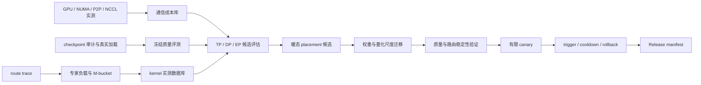

# Q-TopoMoE

[](docs/Q-TopoMoE_release_manifest_20260825.json)
[](docs/Q-TopoMoE_gpu111_phase0实测分析.md)
[](env/project.env)
[](tests/)

Q-TopoMoE 是一套面向单机 8×RTX 5090 PCIe 服务器的量化 MoE 推理实验与运行控制方案。
它围绕 Qwen3.6-35B-A3B 建立了从硬件测量、量化质量验证到专家放置和在线回滚的完整链路，
用于回答一个具体问题：在没有 NVLink 的消费级多卡机器上，如何得到可复现、可执行且能安全
回退的 MoE 推理配置。

当前发布标记为 `qtopomoe-phase8-accepted-20260825`。Phase 0–8 的技术验证已经完成；
生产流量切换、扩量和长期容量测试尚未执行。

## 为什么需要这套方案

量化 MoE 的性能不能只由权重位宽判断。在 PCIe 多卡环境中，以下因素会同时影响结果：

- GPU 所属 NUMA 节点、P2P 路径和 collective 类型决定实际通信成本；
- BF16、FP8、W4A16、NVFP4 对显存、kernel 和并行方式的要求不同；
- 每层专家负载随请求变化，静态平均值无法代表尾延迟；
- 专家迁移不仅包含权重，还包含量化尺度、同步提交和故障回滚；
- 不同评测协议、答案抽取方式和截断处理会直接改变质量结论。

因此，仓库不提供一个脱离环境的“最优配置”，而是保存测量方法、选择逻辑、准入条件和当前
目标机器上的验收结果。

## 已完成的工作

| 环节 | 实现与结果 |
|---|---|
| 硬件与通信 | 验证 8 卡 NUMA、PCIe P2P 和 NCCL 数据路径，按映射与 collective 建立通信成本库 |
| 量化与质量 | 审计 BF16、FP8、W4A16、NVFP4 checkpoint；在冻结协议下执行 smoke、全量评测和截断续跑 |
| kernel 数据 | 依据真实请求生成 M-bucket，记录 Triton、WNA16、CUTLASS 等 backend 的有效测量 |
| 策略选择 | 联合 kernel、通信、显存、路由负载和迁移成本评估 TP、DP、EP 候选 |
| 专家放置 | 从暖态逐层专家计数生成限制迁移量的 placement，并接入 vLLM 原生 EPLB 提交路径 |
| 在线控制 | 验证连续窗口触发、冷却期、8-rank 一致提交、恢复和 identity rollback |

这是一项推理系统与评测工程，不包含量化感知训练（QAT）。

## 主要结果

### 全量质量

三种格式使用同一冻结协议，并只在 24,330 条共同可评分样本上比较：

| 格式 | 准确率 | 相对 BF16 |
|---|---:|---:|
| BF16 | 86.9955% | — |
| FP8 | 86.9749% | -0.0206 个百分点 |
| NVFP4 | 86.3009% | -0.6946 个百分点 |

FP8 与 BF16 在当前协议下基本持平；NVFP4 的准确率下降低于项目设定的 1.5 个百分点上限。
完整分科结果和共同样本口径见
[Phase 3 全量质量报告](docs/results/phase3_fullset_quality_closeout_20260812.md)。

### 暖态 placement 与闭环

最终候选 `warm_swap_008_slots_per_layer_v1` 每层移动 8 个槽位，共移动
320/10,240 个槽位（3.125%）。验证结果如下：

| 检查项 | 结果 |
|---|---:|
| 质量 A/B/A | 116 条记录，0 请求失败，0 截断 |
| 路由稳定性 | 短轨迹 excess TV p95 0.045%，长轨迹 0.718%，均低于当前 1% 上限 |
| 有限 canary | 384/384 请求完成，0 失败 |
| 计划提交 | 8/8 rank 提交相同 map 哈希 |
| 自动闭环 | 20 个窗口、2,560 个请求，0 失败 |
| 决策开销 p95 | 0.000102% |
| 回滚后 p99 / 基线 | 61.61% |

这些数值描述的是冻结模型、请求集和目标机器上的技术验收，不代表生产环境容量承诺。
详细过程见 [Phase 8 最终验收](docs/results/phase8_warm_placement_final_acceptance_20260825.md)。

## 系统流程



每一级都读取已经冻结的输入，并生成可检查的机器结果。出现请求缺失、截断、身份字段不一致
或不可行配置误选时，聚合器不会把该轮结果判为通过。

## 代码结构

| 目录 | 内容 |
|---|---|
| [`topology/`](topology/) | GPU、NUMA、P2P 与 NCCL 采集和解析 |
| [`quantization/`](quantization/) | W4A16、NVFP4 量化前检查、执行与 checkpoint 审计 |
| [`evaluation/`](evaluation/) | 官方协议资产、冻结评测集与质量比较 |
| [`clients/`](clients/) | 服务 workload 客户端、质量评测和答案抽取 |
| [`traces/`](traces/) 与 [`analysis/`](analysis/) | 专家路由采集和漂移分析 |
| [`phase4/`](phase4/) | M-bucket workload 生成 |
| [`phase7/`](phase7/) | 迁移成本测量和离线专家放置 |
| [`selector/`](selector/) | kernel 数据库、backend 选择、策略选择和 EPLB 控制策略 |
| [`runtime_patches/`](runtime_patches/) | placement 计划到 vLLM 原生 EPLB 的接入补丁 |
| [`serving/`](serving/) | 服务启动与准入检查 |
| [`scripts/`](scripts/) | 各阶段编排、聚合、Gate 与恢复命令 |
| [`configs/`](configs/) | 冻结实验计划、workload、策略和模型登记 |
| [`tests/`](tests/) | 合并规则、selector、闭环、文档链接和客户端测试 |

代码文件开头均附有中文作用说明；三个按字节哈希绑定历史实验的执行文件保持冻结内容，
其职责在[代码导读](docs/Q-TopoMoE_代码导读.md)中单独说明。

## 快速检查

目标环境为 Linux、CUDA SM120 和单机 8×RTX 5090。仓库默认根目录为 `/data/moe`。
如需覆盖模型和环境路径，先将 [env/local.env.example](env/local.env.example) 复制为本机配置。

```bash
cd /data/moe
source env/activate.sh
make check
python -m unittest discover -s tests
```

以上命令只检查环境、配置和测试，不会启动模型服务。正式实验前应先确认 GPU 进程、监听端口
和输出目录，不能使用 `pkill python`、`killall` 等无法限定到本项目进程的清理命令。

常用实验入口：

```bash
# checkpoint 审计、真实加载、服务 smoke 和质量准入
BACKEND=vllm MODEL_PATH=<checkpoint> OUT_DIR=<新输出目录> \
  bash scripts/gate_qwen35_checkpoint.sh

# full-set 基础轮、截断续跑和共同分母比较
bash scripts/run_fullset_quality_pair.sh nvfp4 <输出目录>
python scripts/merge_fullset_quality_results.py --help
python scripts/compare_fullset_quality_results.py --help

# 暖态 placement、路由、canary 和自动闭环
python scripts/build_warm_placement_candidates.py --help
python scripts/run_phase8_warm_placement_quality_equivalence.py --help
python scripts/run_phase8_route_stability_diagnostic.py --help
python scripts/run_phase8_selector_limited_canary.py --help
python scripts/run_phase8_selector_closed_loop_acceptance.py --help
```

完整执行顺序和每一级 Gate 见
[逐步执行 Runbook](docs/Q-TopoMoE_逐步执行Runbook.md)。

## 文档入口

| 目的 | 文档 |
|---|---|
| 了解当前结论和阅读顺序 | [文档索引](docs/README.md) |
| 查看最终推荐模型、候选、策略和哈希 | [Release manifest](docs/Q-TopoMoE_release_manifest_20260825.json) |
| 从头复现实验 | [复现阅读指南](docs/Q-TopoMoE_复现阅读指南.md) |
| 理解模块调用关系 | [代码导读](docs/Q-TopoMoE_代码导读.md) |
| 查看硬件与通信测量 | [Phase 0 实测](docs/Q-TopoMoE_gpu111_phase0实测分析.md) |
| 查看量化、kernel、路由和 placement 结果 | [阶段报告索引](docs/README.md#阶段报告) |
| 准备生产部署 | [发布与生产部署清单](docs/Q-TopoMoE_项目发布与生产部署清单_20260825.md) |

## 复现和发布边界

- 大体积模型、完整 JSONL、日志和 trace 不进入 Git；来源、冻结参数和关键哈希记录在
  [Release manifest](docs/Q-TopoMoE_release_manifest_20260825.json)及阶段机器摘要中。
- full-set 只比较三种格式共同可评分的样本；达到输出上限的记录保持未完成状态，不计入正确或错误。
- 当前仓库冻结的是技术验收版本。生产小流量、扩量、长期稳定性和容量承诺需要单独执行。
