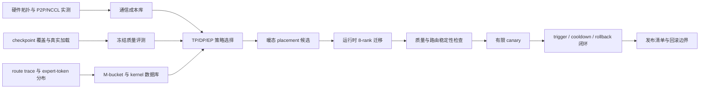

# Q-TopoMoE

面向单机 8×RTX 5090 PCIe 环境的量化 MoE 推理实验与控制系统。项目把硬件拓扑测量、
量化质量评测、kernel/backend 选择、专家放置和在线回滚串成一条可复现的准入链，目标是在
保持模型质量的前提下，得到可执行、可验证、可回退的多卡推理方案。

> 当前版本：`qtopomoe-phase8-accepted-20260825`
> 项目状态：Phase 0–8 技术验收完成；生产流量切换与长期容量验证未执行。

## 项目解决什么问题

RTX 5090 没有 NVLink。量化 MoE 在这类机器上不只是“换一种权重格式”：模型格式会改变
显存占用、可用 kernel 和并行策略，专家路由又会改变跨卡通信与尾延迟。Q-TopoMoE 因此同时
处理四类问题：

- 测出 GPU、NUMA、PCIe P2P 与 NCCL 的真实成本，而不是按卡号推断拓扑；
- 在同一冻结协议上比较 BF16、FP8、W4A16 与 NVFP4，隔离格式、后端和评测口径；
- 用真实 expert-token 分布建立 M-bucket、kernel 数据库和 TP/DP/EP 策略选择器；
- 将离线 placement 落到 8 rank 运行时，并验收触发、冷却、恢复和回滚闭环。

本项目是推理系统与评测工程，不包含量化感知训练（QAT）。

## 核心结果

| 方向 | 已完成结果 | 证据 |
|---|---|---|
| 全量质量 | 在 24,330 条共同可评分样本上，BF16、FP8、NVFP4 准确率分别为 86.9955%、86.9749%、86.3009%；NVFP4 相对 BF16 下降 0.6946 个百分点 | [三格式 full-set 报告](docs/results/phase3_fullset_quality_closeout_20260812.md) |
| 多卡成本建模 | 完成 8 卡拓扑、NUMA、P2P、NCCL 与服务矩阵实测，并形成通信成本库 | [Phase 0 实测](docs/Q-TopoMoE_gpu111_phase0实测分析.md) |
| kernel 与策略选择 | 以真实 M-bucket 组织 kernel/backend 数据，完成四候选、108 个场景、每场景 5 次重复的正式矩阵 | [Phase 4–7 报告](docs/results/phase4_to_phase7_engineering.md) |
| 暖态专家放置 | 最终候选每层移动 8 个槽位，共移动 320/10,240 个槽位（3.125%）；116 题 A/B/A 质量检查零请求失败、零截断 | [Phase 8 最终验收](docs/results/phase8_warm_placement_final_acceptance_20260825.md) |
| 有限 canary | 完成 384 个匹配请求，失败数为 0；恢复阶段 p99/稳定阶段 p99 为 61.65% | [最终验收 JSON](docs/Q-TopoMoE_Phase8_warm_placement_final_acceptance_20260825.json) |
| 自动闭环 | 完成 20 个窗口、2,560 个请求，覆盖 trigger、cooldown、8-rank apply 与 rollback；失败数为 0 | [发布清单](docs/Q-TopoMoE_项目发布与生产部署清单_20260825.md) |

这些数字只适用于仓库冻结的模型、评测协议和目标机器。技术验收通过不等于已完成生产部署。

## 系统逻辑



每一级只消费上一级已经冻结的输入。报告用于解释结论，JSON 和 manifest 用于核对状态、
参数与 SHA-256；缺少请求、出现截断或身份字段不一致时，聚合器不会生成通过结论。

## 关键实现

| 模块 | 主要实现 | 作用 |
|---|---|---|
| 服务准入 | [`scripts/gate_qwen35_checkpoint.sh`](scripts/gate_qwen35_checkpoint.sh)、[`serving/acceptance.sh`](serving/acceptance.sh) | 串联模型哈希、服务启动、健康检查、并发 smoke 与质量评测 |
| 质量评测 | [`clients/quality_eval.py`](clients/quality_eval.py)、[`scripts/merge_fullset_quality_results.py`](scripts/merge_fullset_quality_results.py) | 记录逐题结果、答案抽取与 finish reason；严格合并基础轮和定向续跑 |
| 路由分析 | [`traces/capture_routes.py`](traces/capture_routes.py)、[`analysis/route_drift.py`](analysis/route_drift.py) | 采集逐 token 专家 ID，计算路由重合度、翻转率和负载变化 |
| kernel 选择 | [`selector/kernel_db.py`](selector/kernel_db.py)、[`selector/backend_selector.py`](selector/backend_selector.py) | 只允许实测且有效的 M-bucket 记录进入默认选择 |
| 并行策略 | [`selector/strategy_selector.py`](selector/strategy_selector.py) | 联合计算、通信、负载不均和迁移成本选择 TP/DP/EP 候选 |
| placement | [`phase7/placement.py`](phase7/placement.py)、[`runtime_patches/qtopomoe_eplb/sitecustomize.py`](runtime_patches/qtopomoe_eplb/sitecustomize.py) | 生成专家到物理槽位的映射，并迁移 NVFP4 权重及辅助尺度 |
| 在线控制 | [`selector/eplb_policy.py`](selector/eplb_policy.py)、[`scripts/run_phase8_selector_closed_loop_acceptance.py`](scripts/run_phase8_selector_closed_loop_acceptance.py) | 实现连续窗口触发、冷却期、版本化提交和回滚 |

更完整的调用关系见[代码导读](docs/Q-TopoMoE_代码导读.md)。

## 仓库导航

| 想了解的内容 | 入口 |
|---|---|
| 当前结论与阅读顺序 | [文档索引](docs/README.md) |
| 最终推荐组合、哈希与状态 | [Release manifest](docs/Q-TopoMoE_release_manifest_20260825.json) |
| BF16/FP8/NVFP4 全量质量 | [full-set 质量收尾](docs/results/phase3_fullset_quality_closeout_20260812.md) |
| Phase 8 placement 与闭环 | [最终验收报告](docs/results/phase8_warm_placement_final_acceptance_20260825.md) |
| 从头理解和复现 | [复现阅读指南](docs/Q-TopoMoE_复现阅读指南.md) |
| 按阶段执行 | [逐步执行 Runbook](docs/Q-TopoMoE_逐步执行Runbook.md) |
| 查询配置、结果和哈希 | [数据与产物清单](docs/DATA_CATALOG.md) |
| 生产部署前检查 | [发布与生产部署清单](docs/Q-TopoMoE_项目发布与生产部署清单_20260825.md) |

## 快速验证

目标运行环境为 Linux、CUDA SM120 和单机 8×RTX 5090。模型权重、完整 JSONL、日志与 trace
体积较大，不存入 Git；仓库通过 manifest 固定来源、参数和哈希。

在服务器仓库根目录执行：

```bash
cd /data/moe
source env/activate.sh
make check
python -m unittest discover -s tests
```

`env/activate.sh` 只设置项目、CUDA 和 NCCL 环境，不占用 GPU，也不启动服务。

需要运行模型实验时，先阅读[复现阅读指南](docs/Q-TopoMoE_复现阅读指南.md)和
[逐步执行 Runbook](docs/Q-TopoMoE_逐步执行Runbook.md)。常用入口如下：

```bash
# checkpoint：覆盖审计 → 真实加载 → 服务验收 → smoke → 质量检查
BACKEND=vllm MODEL_PATH=<checkpoint> OUT_DIR=<新输出目录> \
  bash scripts/gate_qwen35_checkpoint.sh

# full-set：同一冻结协议下运行、续跑、严格合并和共同分母比较
bash scripts/run_fullset_quality_pair.sh nvfp4 <输出目录>
python scripts/merge_fullset_quality_results.py --help
python scripts/compare_fullset_quality_results.py --help

# Phase 8：候选生成 → 质量 → 路由 → canary → 自动闭环
python scripts/build_warm_placement_candidates.py --help
python scripts/run_phase8_warm_placement_quality_equivalence.py --help
python scripts/run_phase8_route_stability_diagnostic.py --help
python scripts/run_phase8_selector_limited_canary.py --help
python scripts/run_phase8_selector_closed_loop_acceptance.py --help
```

正式运行前必须核对 GPU PID、监听端口和输出目录。禁止使用 `pkill python`、`killall` 等
无法限定到本项目进程的清理方式。

## 复现与发布边界

1. 当前发布组合以 [Release manifest](docs/Q-TopoMoE_release_manifest_20260825.json) 为唯一入口；
   不从单个配置文件推断最终状态。
2. 大体积运行产物不入库，必须先按 [数据与产物清单](docs/DATA_CATALOG.md)核对来源和哈希。
3. full-set 只在三种格式都可评分的共同样本上比较；达到输出上限的样本保持未完成状态，
   不静默计对或计错。
4. 生产小流量、扩量、长期稳定性和容量承诺属于独立部署工作，不包含在当前技术验收中。
