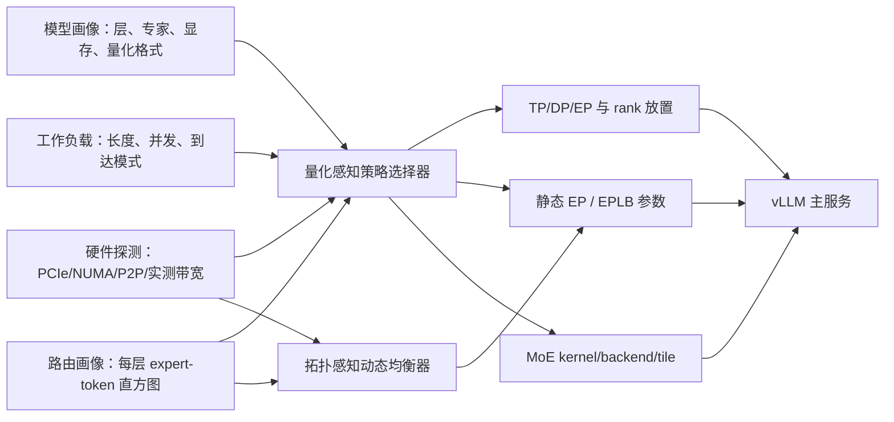

# Q-TopoMoE：面向 PCIe 多 GPU 的量化感知 MoE 并行、动态负载均衡与 SM120 算子协同优化

> 适用平台：单机 8×NVIDIA GeForce RTX 5090（SM120、32 GB/卡、PCIe 互连）
> 方案核验日期：2026-08-07
> 推荐主模型：Qwen3.6-35B-A3B（35B 总参数、3B 激活参数、256 个专家）

> **实机基线**：gpu-111 的 GPU P2P 已启用，8×8 peer access 全部可用。
> TP2 优先使用 PIX 对 `(0,1)`、`(2,3)`、`(4,5)`、`(6,7)`；EP4
> 优先单 NUMA，EP8 作为跨 NUMA 压力项。完整测量和约束见
> [Phase 0 实测分析](Q-TopoMoE_gpu111_phase0实测分析.md)。

## 1. 结论

项目按一条因果链组织，不把量化、并行和 CUDA 优化拆成互不关联的章节：

**量化格式改变显存约束和单 token 计算时间 → 最优 TP/DP/EP 组合与通信占比发生变化 → 量化引起的路由漂移改变专家负载 → 拓扑感知 EPLB 与面向真实专家 token 分布的 SM120 kernel 再共同优化尾延迟。**

建议的范围是：

| 模块 | 可行性 | 在课题中的定位 | 建议 |
|---|---:|---|---|
| Qwen3.6 MoE 的 FP8/W4A16 离线量化 | 高 | 稳定主变量 | 纳入核心贡献 |
| Qwen3.6 MoE 的 NVFP4/FP8 混合量化 | 中高 | 研究主变量；EP 需过兼容性门 | 纳入核心贡献但允许降级 |
| 量化感知 TP/DP/EP 策略选择 | 高 | 系统主线 | 纳入核心贡献 |
| 量化路由漂移分析 + 拓扑感知 EPLB | 高 | 原题强化 | 纳入核心贡献 |
| 已有 SM120 MoE 后端选择和参数调优 | 高 | 算子保底成果 | 纳入核心交付 |
| 自研 NVFP4 ragged grouped GEMM 或 pack/quant 融合 | 中 | 增强贡献 | 设置两周停损点 |
| 重写完整 MoE 通信库或复现 DeepEP | 低 | 偏离平台条件 | 不做 |

因此，推荐题目为：

> **Q-TopoMoE：面向 PCIe 多 GPU 系统的量化感知 MoE 推理并行策略选择、动态负载均衡与 SM120 算子协同优化研究**

量化应作为必选项；CUDA 算子部分应限定为 **MoE 的 FP8/NVFP4 grouped GEMM、token 重排/打包和后端选择**，并保留“只完成可复现的 backend autotuning，不强求全新 kernel”的降级路径。正式分布式主线优先使用 FP8/W4A16；NVFP4 必须先通过 SM120 多卡兼容性门，再进入 EP/EPLB。

## 2. 为什么当前开源基础足以支撑复现

截至核验日期，没有一个仓库端到端实现本课题，但关键组件已经齐全，集成和联合策略正好构成研究空间。

| 项目/入口 | 已验证的相关能力 | 5090 适配判断 | 在本项目中的用途 |
|---|---|---|---|
| [LLM Compressor：Qwen3.6 NVFP4 MoE 示例](https://github.com/vllm-project/llm-compressor/blob/main/docs/key-models/qwen3.6/nvfp4-moe-example.md) | `targets="Linear"`、NVFP4 W4A4、256 条 UltraChat 校准样本、4096 长度、`moe_calibrate_all_experts=True`，输出 compressed-tensors | 量化高；SM120 EP 有条件 | 主量化流水线与兼容性研究 |
| [compressed-tensors](https://github.com/vllm-project/compressed-tensors) | vLLM/SGLang 可加载的统一权重量化描述与保存格式 | 高 | 量化 checkpoint 交换格式 |
| [NVIDIA ModelOpt 的 Qwen3.6 MoE FP8+NVFP4 AutoQuant 配方](https://github.com/NVIDIA/Model-Optimizer/blob/2f6e77f14cd80593ddc0dda434f5acfb77a62e7c/modelopt_recipes/huggingface/qwen3_6_moe/auto_quantize/w4a16_nvfp4_fp8_at_6p0bits-active_moe.yaml) | 面向 active-MoE 成本模型的 FP8/NVFP4 混合量化，目标有效 6 bit | 中高 | 高阶混合精度扩展；先过真实加载门槛 |
| [vLLM modular MoE kernel 设计](https://github.com/vllm-project/vllm/blob/d9dac2b3d4cdd57ff2f7c5311bc8aaf3eef3feec/docs/design/fused_moe_modular_kernel.md) | 将 prepare/dispatch、experts、finalize/reduce 分层，可单独替换 expert kernel，并提供组合测试和 profiler | 高 | 主服务引擎和自研 kernel 接口 |
| [vLLM expert-parallel 部署](https://docs.vllm.ai/en/latest/serving/expert_parallel_deployment/) | EP、EPLB、冗余专家与多种 All-to-All backend；通用 `allgather_reducescatter` 不依赖 NVLink | 高 | PCIe 分布式系统主基线 |
| [SGLang 量化支持表](https://github.com/sgl-project/sglang/blob/a2d1003b185fd060d7375ada08a3894c9d07f6fa/docs_new/docs/advanced_features/quantization.mdx) | SM120 上的 FP4/FP8 backend 路径，`flashinfer_cutlass` 可服务 SM100/SM120 | FP8 高；NVFP4 EP 有条件 | 第二实现交叉验证 |
| [SGLang FlashInfer-CUTLASS MoE runner](https://github.com/sgl-project/sglang/blob/d48ab2d386e0287f471d5fafd1e39f35de148eed/python/sglang/srt/layers/moe/moe_runner/flashinfer_cutlass.py) | BF16、FP8、NVFP4 及 TP/EP/All-to-All 接口 | 接口存在；组合需实测 | SM120 端到端后端候选 |
| [SGLang Triton fused-MoE tuner](https://github.com/sgl-project/sglang/blob/main/benchmark/kernels/fused_moe_triton/README.md) | 可回放 `topk_ids`，调 BLOCK_M/N/K、GROUP_M、warps、stages，覆盖 TP/EP | 高 | 最低风险的算子调优成果 |
| [CUTLASS SM120 NVFP4 grouped GEMM 示例](https://github.com/NVIDIA/cutlass/blob/f94ec46f4f63f96003d6cfdf2014731e7672c281/examples/79_blackwell_geforce_gemm/79d_blackwell_geforce_nvfp4_grouped_gemm.cu) | 明确针对 GeForce Blackwell SM120，支持变长 M/N/K group、FP4 block scale 和 device-side scheduling | 中高 | 自研 kernel 的正确起点 |
| [FlashInfer SM12x 动态 MoE kernel](https://github.com/flashinfer-ai/flashinfer/blob/1d2fc15ca10a8d1b9979e41c1ab0141087a519af/flashinfer/fused_moe/cute_dsl/blackwell_sm12x/moe_dynamic_kernel.py) | 展示 route/pack→FC1→activation/quant→FC2→scatter 的队列式融合方向 | 中 | 研究参考；该文件自述为 first implementation pass，不能直接当稳定基线 |
| [DeepGEMM](https://github.com/deepseek-ai/DeepGEMM) | FP8/FP4 MoE 与融合思路，但当前公开要求 SM90/SM100 | 低 | 只参考设计，不作为 SM120 运行基线 |
| [DeepEP](https://github.com/deepseek-ai/DeepEP) | 高吞吐/低延迟 MoE dispatch/combine，但主要面向 Hopper、NVLink、RDMA | 低 | 只参考通信接口，不在 PCIe 5090 上强行复现 |

本次核验采用的关键上游快照为 CUTLASS `f94ec46`、FlashInfer `1d2fc15`、vLLM `d9dac2b`、SGLang `d48ab2d`、Triton `4cf21fe`、ModelOpt `2f6e77f`。它们是评估证据，不应代替项目自己的 lockfile；第一次跑通后必须记录完整 SHA。

关键边界：

1. RTX 5090 是 SM120。不要把 SM100/H100/B100 的 cubin 或 DeepEP 环境假设直接搬过来。
2. vLLM 的“online NVFP4”文档路径当前面向 SM100；5090 应使用 **离线生成并以 compressed-tensors 保存的 NVFP4 checkpoint**。
3. 权重量化并不自动减少跨卡 dispatch 数据。只有在 collective 之前完成 activation quantization，并把 scale 开销算入通信量时，W4A4/FP8 才可能直接降低通信字节数。这必须作为独立消融，而不能预设结论。
4. 量化配方通常排除 router/gate，但前层量化误差会改变后续 hidden states，因此仍可能产生逐层路由漂移；这正是量化与动态负载均衡之间的研究连接点。

5. 当前 SM120 软件栈存在公开缺口：[SGLang SM120 跟踪项](https://github.com/sgl-project/sglang/issues/19637)仍列有 Qwen MoE NVFP4 与 PCIe-switch 通信工作；[FlashInfer SM120 跟踪项](https://github.com/flashinfer-ai/flashinfer/issues/4223)仍在推进 W4A4 MoE/W4A16 EP，现有 B12x 路径也不能直接覆盖 local experts 与全局 experts 不同的 EP 场景；vLLM 也有 5090 MoE 配置和历史 NVFP4 多卡正确性报告。因此不能把“NVFP4+EP+EPLB”列为首期保证项。

6. FlashInfer 当前 SM120 FP8 grouped GEMM 测试对多 group 路径有正确性规避；应先把正确性矩阵做成 G2 前置门。可参考尚未合并的 [dynamic tile selector PR #4318](https://github.com/flashinfer-ai/flashinfer/pull/4318)，但其中其他 SM120 GPU 的性能数字不能外推为 5090 结果。

### 2.1 量化项目优先级

1. **S 级稳定线**：[LLM Compressor](https://github.com/vllm-project/llm-compressor) + compressed-tensors 的 FP8_DYNAMIC/FP8_BLOCK；它最适合正式 TP/DP/EP 基线。
2. **S 级研究价值、A 级工程成熟度**：[ModelOpt](https://github.com/NVIDIA/Model-Optimizer) 的 routed experts NVFP4、attention FP8、敏感 linear-attention/router/gate 保留 BF16 的混合策略。
3. **A- 级对照**：[AutoRound](https://github.com/intel/auto-round) 或 LLM Compressor GPTQ 生成 W4A16 compressed-tensors；优先保留 narrow `linear_attn` 为 BF16/FP8。
4. **B 级交叉验证**：[GPTQModel](https://github.com/ModelCloud/GPTQModel)；有 Qwen3.6 测试，但公开快速测试不能代替 40 层完整量化证据。
5. **C 级算子原型**：[TorchAO](https://github.com/pytorch/ao)；当前 vLLM TorchAO 路径并非 FusedMoE 主部署通道。

不建议使用已转入维护替代路线的 AutoGPTQ/AutoAWQ 作为新项目基座，也不使用只有 fake-quant、没有实际压缩 kernel 的结果得出性能结论。

### 2.2 引擎分工

- **vLLM 主系统轨**：FP8/W4A16 的 TP/DP/EP、通用 PCIe collective、EPLB、modular experts kernel 和端到端性能。
- **SGLang/FlashInfer 算子轨**：SM120 FP8/NVFP4 backend、Triton autotune、真实 `topk_ids` 回放和正确性定位。
- 只有在算子轨通过 correctness 与收益门槛后，才把新 experts kernel 接入 vLLM；最终只对 Pareto 前沿 1–2 组做跨引擎复现，避免双框架全矩阵。

## 3. 研究问题与可检验假设

### RQ1：量化是否改变 PCIe 单机的最优并行策略？

- H1：BF16、FP8、NVFP4 的计算/通信比不同，最优 TP/DP/EP 组合不会保持不变。
- H2：量化释放的显存允许更多 DP replica 或不同 EP 划分，但只在模型、KV cache 和工作区实际能装入单卡/卡组时成立。

### RQ2：量化是否改变专家路由和 EPLB 收益？

- H3：即使 router 权重保持 BF16，量化造成的 hidden-state 扰动也会使后层 top-k 专家集合发生漂移。
- H4：路由漂移对 p99 的影响大于对平均吞吐的影响，且拓扑感知、带迟滞的动态均衡优于固定周期迁移。

### RQ3：面向真实路由直方图的 SM120 kernel 能否优于固定配置？

- H5：MoE expert GEMM 的 M 极不规则；按 `非空专家数、M_max、M_p50、M 的变异系数、量化格式` 选择 tile/backend，会优于单一静态配置。
- H6：当 GEMM 已被 NVFP4 显著加速后，permute、activation quant/scale、packing 与 launch overhead 会成为更大的比例；融合这些阶段比继续优化大 M GEMM 更有价值。

### RQ4：联合策略能否接近逐工作负载穷举的 oracle？

- H7：一个可解释的分段代价模型或查表控制器，可在未见过的并发/序列长度组合上把性能 regret 控制在可接受范围，同时不违反质量、显存与 p99 SLO。

## 4. 系统设计



### 4.1 离线策略选择

输入：

- GPU/NUMA/PCIe 距离矩阵与实测 P2P、AllGather、ReduceScatter 带宽；
- 模型和量化格式的权重、KV cache、workspace 峰值；
- workload 的输入/输出长度、并发、到达过程和 prefix 命中率；
- 各层 expert-token 直方图；
- 各量化格式和 kernel 对不同 M 桶的实测服务率。

输出：

- 量化格式；
- 可行的 TP、DP、EP、rank-to-GPU 映射；
- static EP 或 EPLB 参数；
- expert kernel/backend 和 tile 配置。

第一版不需要强化学习。使用约束枚举 + 分段性能模型即可：

```text
minimize  predicted_p99_TPOT
        = compute_cost(q, kernel, expert_hist)
        + communication_bytes(q, phase) × measured_link_cost(mapping)
        + imbalance_penalty(route_hist, placement)
        + migration_penalty

subject to peak_HBM < safety_limit
           quality_drop <= declared_limit
           supported(engine, q, kernel, SM120) = true
```

以穷举过的配置作为 oracle，报告 selector 的 top-1 命中率和 regret；如数据量足够，再把 contextual bandit 作为可选扩展。

### 4.2 在线动态负载均衡

在 vLLM EPLB 基线上增加拓扑代价和迁移迟滞：

1. 每个窗口统计逐层、逐专家 token 数及每 GPU expert service time，维护 EMA。
2. 仅当负载 CV 或预测 p99 连续若干窗口越界时触发重算，避免抖动。
3. 有显存余量时复制热点专家；否则交换热点/冷点专家。
4. 目标函数同时惩罚跨 PCIe root/NUMA 的 dispatch 字节和专家迁移字节。
5. 预测收益必须覆盖迁移成本并超过迟滞阈值；发生 p99 回退时自动回滚。

建议比较四组：无 EPLB、原生 EPLB、只考虑负载的自研 EPLB、负载+拓扑+量化感知 EPLB。

### 4.3 SM120 算子课题的最小可交付范围

先捕获真实 `topk_ids` 和每个 expert 的 M，再做两级实现：

- **Level 1，必做**：基于真实直方图搜索 CUTLASS/FlashInfer/Triton backend 与 BLOCK_M/N/K、GROUP_M、warps、stages，生成可版本化的配置表；运行时按 M 分布选配置。
- **Level 2，增强**：以 CUTLASS SM120 NVFP4 grouped GEMM 为起点，实现 small-M/large-M 分桶与 persistent scheduler，或融合 `permute + activation quant/scale + pack`。只选择一个目标。

不要同时重写 FC1、SwiGLU、FC2、dispatch、combine 和通信库。推荐优先顺序：

1. histogram-aware backend/tile selector；
2. permute + quant/scale + pack 融合；
3. ragged NVFP4 grouped GEMM scheduler；
4. 完整 persistent fused-MoE，仅作为后续工作。

集成点优先使用 vLLM 的 `FusedMoEExpertsModular`，保持 prepare/finalize 和通信路径不变，这样能把算子效果与分布式策略效果分离。

## 5. 实验对象与变量

### 5.1 主模型和量化格式

核心矩阵只保留三档，避免项目失控：

| ID | 格式 | 来源 | 作用 |
|---|---|---|---|
| Q0 | BF16 | 原始 Qwen3.6-35B-A3B | 精度和路由参照 |
| Q1 | FP8_DYNAMIC/FP8_BLOCK | 官方 FP8 checkpoint 或统一离线流程 | 正式 TP/DP/EP 稳定基线 |
| Q2 | INT4 W4A16 | GPTQ 或 AutoRound，以 compressed-tensors 保存 | 显存压缩与 Marlin 对照 |
| Q3 | NVFP4 W4A4 | LLM Compressor exact MoE recipe | 先做 TP/DP；EP 通过 gate 后加入 |
| Q4（研究主线） | NVFP4 experts + FP8 attention | ModelOpt active-MoE AutoQuant | 保护敏感层的质量/速度折中 |

粗略权重体积只能用于规划：BF16 约 70 GB、FP8 约 35 GB、4-bit 约 17.5 GB；真实能否以 TP=1/2/4/8 运行，必须加入 embedding、未量化层、scale、KV cache、CUDA graph、kernel workspace 后做峰值显存预检，不能据此直接宣称可装入。

Q2 的 narrow `linear_attn` 等不满足 Marlin tile 的特殊层应显式保留 BF16/FP8。量化验收必须同时满足：

- expert 模块被真正匹配、线性化并保存；
- 每层/专家 scale 或 packed weight 数量与预期一致；
- router/gate、`linear_attn` 等排除项有显式清单；
- vLLM 主引擎真实加载、`/v1/models` 和一次 completion 成功；
- 再进入质量和性能矩阵。

### 5.2 并行与负载均衡变量

在 8 卡上先进行可行性筛选，而不是假设所有组合都能运行：

- 候选 `(TP, DP)`：`(8,1)、(4,2)、(2,4)、(1,8)`；仅保留通过显存和引擎支持检查的组合。
- MoE 模式：普通 TP/DP、EP static、EP + 原生 EPLB、EP + 自研 topology-aware EPLB。EP/EPLB 只对通过多卡真实服务和并发正确性的格式开启；预计先进入正式矩阵的是 FP8/W4A16，NVFP4 为条件扩展。
- All-to-All：PCIe 主基线使用 vLLM 的通用 `allgather_reducescatter`；NVLink 专用 backend 不列为主结果。
- rank 放置：按实际拓扑定义 `compact`（尽量同 PCIe root/NUMA）和 `interleaved`（刻意跨组），再加入策略选择器输出的映射。
- 冗余专家：0/1 起步；只有显存许可且热点显著时再增加。

### 5.3 工作负载

| 类别 | 输入/输出 token | 并发 | 到达方式 | 目的 |
|---|---:|---:|---|---|
| 短交互 | 256/128 | 1、8、32、128 | closed-loop + Poisson | TTFT、调度开销 |
| 中上下文 | 2K/256 | 1、8、32 | Poisson | 常规服务 |
| 长上下文 | 8K/256 | 1、8、16 | Poisson | KV cache 与显存边界 |
| 超长筛选 | 32K/128 | 1、4 | closed-loop | 只对可行配置运行 |
| 突发流量 | 2K/256 | 基线的 4× burst | on/off burst | EPLB 响应与 p99 |

固定公开 prompt 数据集的 revision、抽样索引和顺序；另外生成一组控制专家偏斜程度的 synthetic trace。prefix cache 的 0%、50%、90% 命中场景必须分开报告。

### 5.4 指标

**质量与路由**

- MMLU-Pro、GSM8K、C-Eval/CMMLU、EvalPlus 中选 2–4 个固定任务；
- perplexity 或 teacher-logit divergence；
- 逐层 top-k expert Jaccard、路由概率 KL；
- expert-token 分布的 Gini、CV、最大/均值；
- 量化 scale 饱和率和异常值覆盖。

**kernel**

- p50/p95 kernel latency、有效 TFLOPS、DRAM bytes、launch 次数；
- occupancy、L2 hit、warp stall、不同 M 桶的性能；
- permute/quant/FC1/activation/FC2/unpermute 各段占比；
- 数值误差和零 token、极端偏斜、非对齐 shape 的正确性。

**系统**

- TTFT、TPOT/ITL、E2E latency 的 p50/p95/p99；
- output tokens/s、requests/s、queue time；
- GPU HBM 峰值、SM 利用率、功耗；
- PCIe/NCCL bytes、algobw、busbw；
- EPLB 迁移次数、迁移字节、阻塞时间和 SLO violation。

## 6. 16 周执行方案

| 周次 | 工作 | 可交付物 | 进入下一阶段的门槛 |
|---:|---|---|---|
| 1–2 | 硬件/软件清点，PCIe/NUMA/P2P 与 NCCL 微基准，固定仓库 SHA、容器 digest、模型 revision | `hardware.json`、拓扑矩阵、collective 曲线、环境锁 | 8 卡稳定；确认 SM120；识别至少一种可测的拓扑/带宽差异，或将题目调整为“通信感知” |
| 3 | BF16 与官方 FP8 服务基线；固定服务端/客户端脚本 | 真实 completion、metrics、短/中 workload baseline | 两种格式通过端到端服务门槛 |
| 4–5 | FP8/W4A16 稳定线；LLM Compressor NVFP4 与 ModelOpt mixed 研究线；模块/专家覆盖审计和质量小测 | checkpoint、recipe、manifest、scale coverage、质量表 | FP8/W4A16 可正式多卡；NVFP4 真实加载并决定是否准入 EP |
| 6 | 捕获逐层 `topk_ids`、expert M 直方图和量化路由漂移 | 可回放 trace、route report | trace 能由独立脚本复现；BF16/FP8/W4A16，以及通过 G1 的 NVFP4，对齐同一 prompt |
| 7–8 | SGLang Triton/CUTLASS/FlashInfer 基准与配置搜索；实现 Level 1 selector | kernel config DB、正确性测试、Nsight 报告 | 随机和真实 trace 全部正确；至少一个重要 M 桶有稳定收益 |
| 9 | Level 2 自研融合或 scheduler；两周停损点在本周末生效 | patch、unit test、microbenchmark | 若无正确且可重复的 ≥10% micro 收益，停止新 kernel，保留 Level 1 |
| 10–11 | TP/DP/EP、topology mapping、EPLB 消融；测迁移成本 | 分布式原始结果、Pareto 配置集 | 稳定格式至少有一个可行系统配置；NVFP4 不支持的组合以证据标记，不强行纳入 |
| 12–13 | topology+quant-aware EPLB 与联合选择器 | 控制器、代价模型、oracle regret | 控制开销 <1%；无持续迁移抖动；可在未见 workload 上预测 |
| 14 | 完整 workload 筛选，选择 Pareto 前沿 6 组 | 初版总表 | 质量、显存、SLO 三类约束全部满足 |
| 15 | 每组 5 次独立重复，bootstrap 95% CI，随机化运行顺序 | 最终 raw JSON/CSV、统计图 | 结果可由 manifest 重跑；无只跑一次的正式结论 |
| 16 | 复现包、论文/报告、失败案例与局限 | release tag、复现实验 README、最终报告 | 新环境一条入口命令可完成 smoke；核心表可批量重建 |

### 三道 go/no-go 门

- **G0（第 2 周）**：如果 `nvidia-smi topo -m` 和实测 collective 都几乎无层次差异，保留 PCIe 通信测量，但把“拓扑感知”改成“通信与拥塞感知”；不要人为制造一个没有证据的拓扑故事。
- **G1（第 5 周）**：FP8/W4A16 必须通过多卡服务门槛。NVFP4 通过 expert coverage、真实加载、batch=1/32 正确性和 1/2/4/8 卡检查后，才准入 EP/EPLB；否则仅保留 TP/DP、kernel 和失败分析。
- **G2（第 9 周）**：FlashInfer/CUTLASS/SGLang 所有多 group 路径先通过正确性；自研 kernel 未取得正确、稳定、对关键 M 桶有 ≥10% micro latency 收益时停止投入。论文仍由量化感知策略、路由漂移和 EPLB 完成闭环。

## 7. 实验设计与公平性

不跑完整笛卡尔积。采用四步漏斗：

1. **smoke**：每个 checkpoint、backend、并行组合只跑 8–32 请求，筛加载/正确性/显存。
2. **单次全量筛选**：每种量化保留 2 个可行并行组合；在 4 类代表 workload 上跑一次。
3. **消融**：量化 only、kernel only、mapping only、EPLB only、联合方案；每次只改一个因素。
4. **正式结果**：Pareto 前沿约 6 组，每组独立重启服务并重复 5 次，bootstrap 95% CI。

必须固定：

- 模型和数据 revision、prompt 顺序、sampling 参数和随机种子；
- TP/DP/EP、KV cache dtype、max sequence、GPU memory utilization；
- prefix/radix cache、CUDA graph、MTP/speculative decoding 的开关；
- engine/CUDA/CUTLASS/FlashInfer commit；
- warmup 请求数、测量时长、客户端到达过程；
- GPU clocks/power policy 或至少记录它们；
- server 启动脚本和 client benchmark 脚本必须分离。

建议预注册工程验收标准：

- FP8 相对 BF16 的综合质量下降不超过 0.5 个绝对百分点；NVFP4 不超过 1.5；W4A16 不超过 2.0。这些是项目门槛，不是算法保证。
- 新 kernel 的全 shape 正确性通过，并在目标 M 桶取得 ≥10% micro latency 收益；最终系统收益以 ≥5% tokens/s 或 ≥5% p99 TPOT 改善为工程成功线。
- 联合 selector 在未见 workload 上，相对逐配置 oracle 的 median regret ≤5%、p95 regret ≤10%。
- 在线控制与统计开销 <1%，不因迁移造成持续 SLO 回退。

如果收益小于门槛，也应保留结果：证明 PCIe 通信、permute 或负载偏斜已成为瓶颈，仍然是有效的系统研究结论，但不能表述为优化成功。

## 8. 首轮可复制的环境与基线检查

以下命令在 Linux GPU 服务器执行。先记录事实，再选择版本；不要预设 5090 的 P2P/NCCL 路径。

```bash
mkdir -p artifacts/{hardware,manifests,nccl,raw,profiles,reports}

nvidia-smi -L | tee artifacts/hardware/nvidia-smi-L.txt
nvidia-smi -q | tee artifacts/hardware/nvidia-smi-q.txt
nvidia-smi topo -m | tee artifacts/hardware/topo-m.txt
nvidia-smi topo -p2p r | tee artifacts/hardware/topo-p2p-read.txt
nvidia-smi topo -p2p w | tee artifacts/hardware/topo-p2p-write.txt
lspci -tv | tee artifacts/hardware/lspci-tree.txt
numactl --hardware | tee artifacts/hardware/numa.txt
nvcc --version | tee artifacts/hardware/nvcc.txt

python - <<'PY' | tee artifacts/hardware/torch-cuda.txt
import json, torch
print(json.dumps({
    "torch": torch.__version__,
    "cuda_runtime": torch.version.cuda,
    "device_count": torch.cuda.device_count(),
    "devices": [
        {
            "id": i,
            "name": torch.cuda.get_device_name(i),
            "capability": torch.cuda.get_device_capability(i),
            "memory_bytes": torch.cuda.get_device_properties(i).total_memory,
        }
        for i in range(torch.cuda.device_count())
    ],
}, indent=2))
PY
```

随后用 `nccl-tests` 至少测 AllReduce、AllGather、ReduceScatter 和 SendRecv，分别覆盖 8 B 到 1 GiB；保存完整命令、rank 映射、algobw/busbw。再用 CUDA `p2pBandwidthLatencyTest` 建立实测距离矩阵。

主服务命令采用版本锁定后的 vLLM 模板，服务端和压测端分文件：

```bash
# serving/start_vllm.sh：参数名必须以锁定版本的 `vllm serve --help` 为准
CUDA_VISIBLE_DEVICES=0,1,2,3,4,5,6,7 \
vllm serve "$MODEL_DIR" \
  --served-model-name qwen36 \
  --tensor-parallel-size "$TP" \
  --data-parallel-size "$DP"

# 仅对已通过 G1 多卡门槛的 checkpoint 增加：
#   --enable-expert-parallel \
#   --all2all-backend allgather_reducescatter
```

每个 checkpoint 的最小服务门槛：进程正常、`/v1/models`、真实 `/v1/chat/completions`、指标端点、32 请求 smoke 全部通过。依赖能 import 或 kernel 单测通过，不等价于服务可用。

仓库和环境必须在第一次成功运行后立即冻结：

```bash
git -C third_party/vllm rev-parse HEAD
git -C third_party/llm-compressor rev-parse HEAD
git -C third_party/cutlass rev-parse HEAD
git -C third_party/flashinfer rev-parse HEAD
python -m pip freeze --all
sha256sum checkpoints/*/config.json checkpoints/*/*.safetensors.index.json
```

SM120 kernel lane 建议使用当前 CUTLASS 明确支持的工具链，并先运行官方 `79d_blackwell_geforce_nvfp4_grouped_gemm` 示例。编译目标应由锁定 CUDA/CUTLASS 的 CMake 检测结果决定；不得把 SM100 二进制当成 5090 基线。CUDA 官方编译器文档可核对 [`sm_120/sm_120f/sm_120a`](https://docs.nvidia.com/cuda/archive/13.0.0/cuda-compiler-driver-nvcc/index.html)。

## 9. 建议仓库结构

```text
q-topomoe/
├── README.md
├── Makefile
├── configs/
│   ├── models/
│   ├── workloads/
│   └── experiments/
├── env/
│   ├── containers/
│   ├── requirements-lock/
│   └── repos.lock.tsv
├── topology/
│   ├── collect_hardware.sh
│   ├── nccl_bench.sh
│   └── build_cost_matrix.py
├── quantization/
│   ├── llm_compressor/
│   ├── modelopt/
│   └── audit_checkpoint.py
├── traces/
│   ├── capture_routes.py
│   └── replay_topk.py
├── kernels/
│   ├── cutlass_sm120/
│   ├── triton_tuner/
│   ├── selector/
│   └── tests/
├── serving/
│   ├── start_vllm.sh
│   └── start_sglang.sh
├── clients/
│   ├── smoke.py
│   ├── open_loop.py
│   └── accuracy.sh
├── controller/
│   ├── cost_model.py
│   ├── placement.py
│   └── eplb_policy.py
├── experiments/
│   ├── run_matrix.py
│   └── manifest.schema.json
├── analysis/
│   ├── aggregate.py
│   └── figures.py
└── artifacts/                 # 原始结果只增不改
```

一条正式运行记录至少包含：`run_id、UTC 时间、hostname、GPU UUID、拓扑 hash、所有 git SHA、容器 digest、模型/数据 revision、checkpoint hash、完整命令、环境变量、配置 YAML、stdout/stderr、服务指标、客户端原始 JSON`。

## 10. 最终论文/项目应交付的证据

1. 三种量化格式的模型文件、配方、模块/专家覆盖审计和质量结果。
2. 8×5090 的 PCIe/NUMA/P2P/collective 性能画像。
3. 量化格式对可行 TP/DP/EP 空间和最优策略迁移的证据。
4. BF16→FP8/NVFP4 的逐层 route Jaccard、expert load 与 p99 关系。
5. 原生 EPLB、负载感知 EPLB、拓扑+量化感知 EPLB 的严格消融。
6. 真实 route trace 上的 kernel correctness、M 桶性能和端到端收益。
7. selector 相对 oracle 的 regret、决策开销和跨 workload 泛化。
8. 包含失败配置和不支持矩阵的完整复现包，而不是只公布最优数字。

## 11. 优先阅读资料

### 直接复现入口

- [Qwen3.6 项目](https://github.com/QwenLM/Qwen3.6) 与 [Qwen3.6-35B-A3B-FP8 模型卡](https://huggingface.co/Qwen/Qwen3.6-35B-A3B-FP8)
- [LLM Compressor 的 Qwen3.6 总览](https://github.com/vllm-project/llm-compressor/blob/main/docs/key-models/qwen3.6/index.md) 与 [NVFP4 MoE 完整配方](https://github.com/vllm-project/llm-compressor/blob/main/docs/key-models/qwen3.6/nvfp4-moe-example.md)
- [vLLM 的 LLM Compressor 量化文档](https://docs.vllm.ai/en/stable/features/quantization/llm_compressor/)
- [vLLM modular MoE kernel](https://github.com/vllm-project/vllm/blob/main/docs/design/fused_moe_modular_kernel.md)、[MoE kernel feature matrix](https://github.com/vllm-project/vllm/blob/main/docs/design/moe_kernel_features.md) 和 [NVFP4 CUTLASS MoE benchmark](https://github.com/vllm-project/vllm/blob/main/benchmarks/kernels/benchmark_cutlass_moe_nvfp4.py)
- [SGLang fused-MoE Triton tuner](https://github.com/sgl-project/sglang/blob/main/benchmark/kernels/fused_moe_triton/README.md)
- [CUTLASS SM120 NVFP4 grouped GEMM](https://github.com/NVIDIA/cutlass/blob/main/examples/79_blackwell_geforce_gemm/79d_blackwell_geforce_nvfp4_grouped_gemm.cu) 与 [grouped scheduler 说明](https://docs.nvidia.com/cutlass/latest/media/docs/cpp/grouped_scheduler.html)
- [FlashInfer MoE EP runbook](https://github.com/flashinfer-ai/flashinfer/blob/main/docs/design_docs/moe_ep_runbook.md)

### 方法与论文

- [AWQ, MLSys 2024](https://proceedings.mlsys.org/paper_files/paper/2024/hash/42a452cbafa9dd64e9ba4aa95cc1ef21-Abstract-Conference.html)
- [GPTQ, ICLR 2023](https://arxiv.org/abs/2210.17323)
- [SmoothQuant, ICML 2023](https://proceedings.mlr.press/v202/xiao23c.html)
- [Tutel, MLSys 2023](https://proceedings.mlsys.org/paper_files/paper/2023/hash/5616d34cf8ff73942cfd5aa922842556-Abstract-mlsys2023.html)
- [DeepEP](https://github.com/deepseek-ai/DeepEP) 与 [DeepGEMM](https://github.com/deepseek-ai/DeepGEMM)：用于理解融合和通信设计，不用于宣称 SM120 直接复现

## 12. 推荐的最小成功版本

如果目标是最大化完成概率，最终至少完成以下闭环：

1. BF16、FP8、W4A16 三个可真实服务的 checkpoint；NVFP4 至少完成 TP 路径，若上游阻塞则交付可复现失败证据；
2. 8 卡实测拓扑/collective 成本矩阵；
3. 每种通过 gate 的精度所对应的可行 TP/DP/EP 空间与最优策略；
4. 路由漂移、专家不均衡和尾延迟之间的定量关系；
5. topology+quant-aware EPLB，相对原生 EPLB 的消融；
6. 一个真实 trace 驱动的 SM120 kernel/backend selector；
7. 一条命令可重建 smoke、一个 manifest 可重建正式结果。

这已经是一项完整、具有系统研究价值且可复现的项目。自研 fused CUDA kernel 是增强项，而不是成败单点。
