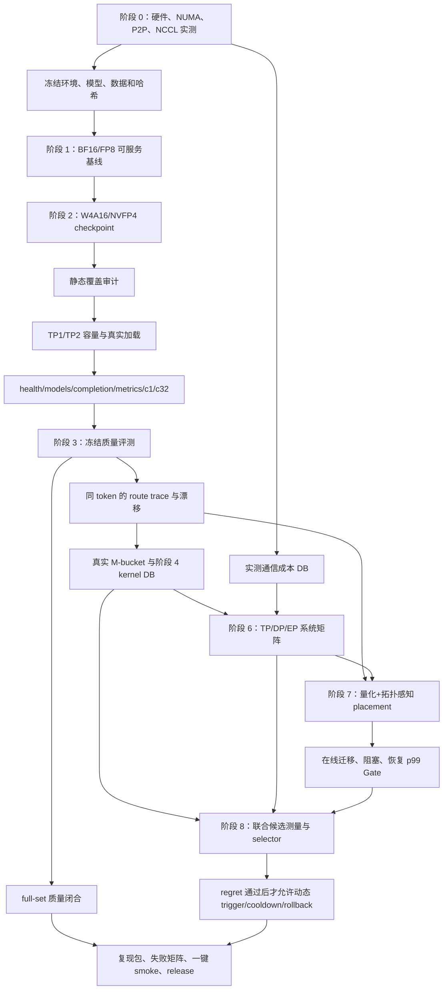

# Q-TopoMoE 项目执行全史、执行逻辑与问题处置

> 文档日期：2026-08-13（Asia/Shanghai）
> 覆盖范围：本项目从仓库初始化、gpu-111 硬件画像、BF16/FP8 基线、W4A16/NVFP4、
> route trace、SM120 kernel、TP/DP/EP、EPLB、联合策略选择器，到 full-set 质量收尾的全部已记录工作。
> 当前 Git 分支：`agent/sync-q-topomoe-project`。
> 状态口径：机器可读 Gate 和冻结输入哈希高于历史报告；失败、拒绝和中断结果均保留，
> 但不提升为成功结论。

## 1. 项目目标与“量化感知”的实际含义

项目面向单机 8×RTX 5090、双 NUMA、PCIe 互连环境，研究四类模型格式
（BF16、FP8、W4A16、NVFP4）在 MoE 推理中的：

1. 拓扑感知 TP/DP/EP 映射；
2. SM120 kernel/backend 选择；
3. 量化格式、路由负载、显存与通信共同约束下的专家放置；
4. 在线迁移、恢复和长尾影响；
5. 联合策略选择及相对 oracle 的 regret。

标题中的“量化感知”是指推理系统在选择并行策略、kernel、专家放置和迁移计划时，
显式感知量化格式、专家字节数、scale 布局和后端能力，并不是“量化感知训练（QAT）”。
项目评估过是否增加 QAT 分支，最终按用户决策不增加；主线继续采用训练后量化/已有量化
checkpoint 与严格质量 Gate。W4A16 的 GPTQ/压缩路径只是候选量化实现，不改变项目性质。

## 2. 总体执行逻辑

核心原则如下：

- 先证明“可加载、可服务、质量合格”，再进入性能和系统矩阵；
- 先采集真实 topology、route 和 M 分布，再训练或回放选择器；
- 计划值、micro kernel 和端到端服务结果分层记录，不能相互冒充；
- 每个阶段都设 Gate；失败后退出主线、降级为对照或回到上游修复；
- 大模型权重、完整日志和大 JSONL 留在服务器，Git 记录代码、摘要、manifest、SHA-256
  与失败证据；
- 长时间 GPU 任务与不依赖其输出的控制面开发并行进行，但所有下游正式结论必须等
  上游 Gate 通过后再绑定真实数据。

## 3. 工作完成顺序

### 3.1 2026-08-03 至 2026-08-04：启动、拓扑与基线

1. 建立标准仓库、目录职责、环境变量、运行 manifest 和 Git 同步分支。
2. 采集 gpu-111 的 8 卡型号、PCIe/NUMA、peer access、NCCL collective、BF16
   正确性和 GPU 占用，形成阶段 0 基线。
3. 冻结 BF16 checkpoint 身份、配置与哈希；建立 SGLang/vLLM 独立服务入口和
   health、模型发现、真实 completion、metrics 四级验收。
4. 完成 BF16/FP8 的拓扑矩阵和统计，明确哪些失败是容量问题、哪些是量化 block
   对齐问题。
5. 为 W4A16 创建独立量化环境，冻结 WikiText 256 条校准集、样本顺序、tokenizer、
   chat template、seed 和 SHA-256；启动长时间量化。
6. 量化运行期间，没有等待 GPU 空转，而是并行实现阶段 4 backend selector 框架、
   M-bucket workload 生成器、阶段 8 策略候选/成本数据结构、BF16/FP8 统计分析。

### 3.2 2026-08-05：W4A16 规范化、框架适配与质量协议修复

1. W4A16 量化完成后执行 40 层、256 experts、30,720 个 routed expert linear
   的覆盖审计和真实加载 Gate。
2. 冻结 vLLM、SGLang、Transformers、compressed-tensors 的 cleanroom 版本，
   区分“上游原生支持”和“开发期 adapter 能跑”。
3. 发现原始导出是 text-only config，但权重保留 `model.language_model.*` 前缀；
   建立 canonicalization，逐张量验证 shape、dtype 和值不变，生成规范 checkpoint。
4. 修正 Qwen3.5 tokenizer/chat template ID；让分片 checkpoint、TP1/TP2、SGLang
   单体 TP4 启动模式和 JIT 子进程工具路径进入统一 Gate。
5. 建立冻结 BF16/W4A16 质量集、安全 API evaluator、超时覆盖、答案抽取和
   `truncated` 强拒绝规则。
6. 隔离比较 vLLM Triton、vLLM Marlin 和 SGLang W4 路径。Marlin 出现严重质量
   回退，正式 W4 质量结论固定到 Triton，避免把后端缺陷误判为量化本身。
7. 发现最初 smoke 与模型卡 MMLU-Pro/C-Eval 数字不可直接比较，转向官方协议对齐的
   few-shot/COT、答案提取和全量评测资产。

### 3.3 2026-08-06：W4 全量质量、route trace、kernel 与 Level 2

1. 冻结 MMLU-Pro 和 C-Eval 共 24,374 条官方协议输入、分片、样本 ID 与哈希。
2. W4A16 使用 2×TP4 双服务跑完 full-set；基础轮截断 1,206 条，随后提高输出上限
   定向补跑。最终已计分结果为 MMLU-Pro 84.58%、C-Eval 89.27%，另保留 21 条
   长输出未收敛样本，不把它们静默当作错误答案。
3. 在 vLLM 原生 router top-k 位置采集 BF16/W4 route trace，计算 Jaccard、flip、
   expert load correlation/CV 等漂移指标；将路由漂移作为 placement 和 selector 输入。
4. 实测 vLLM Triton BF16/FP8、FlashInfer CUTLASS BF16 kernel，建立正确的总 token
   数语义 M-bucket 数据库。
5. Profile 后实现 `permute + activation quant/scale + pack` Triton 融合 kernel；
   极端 shape 正确性通过。随后与真实 vLLM prepare 路径 A/B，按真实 M 分布判定
   加权性能反而慢 34.4%，触发停损，不接入服务。

### 3.4 2026-08-07：P2P 生效后的结论反转与系统重测

1. 系统 P2P 配置生效后，8×8 peer read/write 非对角项全部为 `OK`，NCCL 使用
   `P2P/direct pointer`。原“P2P 不可用”的硬件基线不再适用。
2. 重跑 NCCL、BF16/FP8 服务、阶段 3 pilot、阶段 6 TP/DP/EP 和阶段 7 迁移成本；
   P2P 前的多卡性能数据降为历史对照。
3. 结果证明 P2P 对通信密集的 TP2×DP2、TP4×DP2 等配置提升最大；策略选择从
   NODE 优先反转为实测更优的 PIX TP2。
4. 对 W4A16 做 group128→group64 的无损重分块，逐值验证 `max diff=0`，解决
   TP8 分片对 block 对齐的格式限制。
5. 完成四卡和八卡 TP/DP/EP smoke 矩阵、迁移成本微基准和离线 placement；
   load-aware placement 将不均衡从约 2%–3% 降至 0.02%。

### 3.5 2026-08-08 至 2026-08-09：官方 NVFP4、自生成 NVFP4 与 EP 准入

1. 从 ModelScope 获取 RedHatAI 官方 NVFP4 checkpoint，完成 30,720 routed
   projection 全覆盖审计。
2. 官方 NVFP4 在 SM120 上通过 TP1/TP2、c1/c32 和四级服务 Gate；非 EP 服务
   使用原生 `VLLM_CUTLASS`，没有回退到 emulation。116 条 official-like v2
   总体比 BF16 低 0.86 个百分点，准入正式主线。
3. 使用 256 条冻结 UltraChat 校准数据自生成 NVFP4，完成 canonicalization、
   TP1/TP2/TP4 和服务 Gate，但质量比 BF16 低 3.45 个百分点，超过 1.5 点门槛，
   selfgen v1 被拒绝，不进入 EP/EPLB。
4. 采集 BF16→官方 NVFP4 route drift；尽管 token 级 top-k 改变明显，expert count
   correlation 仍为 0.99898，说明总体负载形状稳定。
5. 完成 NVFP4 CUTLASS 真实 M-bucket、EP4/EP8 静态准入与 Phase 8 跨格式筛选。
   明确记录：非 EP 路径为 CUTLASS，而专家分片 EP 运行时选择 MARLIN，二者数据
   不可混写。

### 3.6 2026-08-09 至 2026-08-10：阶段 8 从回放走向受控正式矩阵

1. 完成 FP8 TP2、W4A16 EP4、NVFP4 EP4/EP8 的单次跨格式筛选。
2. 建立随机顺序、每候选五次重复、10,000 次 bootstrap 的 runner；修复固定
   vLLM 入口、JIT 工具路径和后端日志 Gate 后得到可接受重复结果。
3. 发现旧透明成本模型不能识别 prefix-cache 和到达过程，先记录 held-out 校准失败，
   再构造受控 cache 0/50/100%、closed-loop/Poisson/burst 和冻结到达率的 108-cell
   workload。
4. 依次修复 cache page 对齐、调度延迟定义、burst 批次原子性和编排器终态落盘，
   v1/v2 被明确拒绝，v3 恢复后完成正式运行。

### 3.7 2026-08-11 至 2026-08-12：仓库治理、在线迁移与正式收尾

1. 审核仓库文档和数据文件，合并不会影响复现的叙述文档，保留机器可读证据稳定路径；
   修复 Markdown 内部链接，将人类可读文档统一为中文，并建立 README、文档索引、
   数据清单和文件命名规则。
2. 服务器仓库从 `/home/k8s-ops/moe` 迁移到 `/data/moe`；修复迁移后 vLLM 环境路径、
   Python 模块入口和编译工具路径，增加 full-set 可断点续跑编排。
3. 原离线 placement 没有限制每层每 rank 固定 32 个物理专家槽，不能直接上线；
   改为由同一 expert-token histogram 生成 `40×256` 且每卡每层严格 32 槽的
   runtime plan，通过显式 opt-in bridge 应用。
4. 完成稳定、同步迁移阻塞和恢复三个窗口共 384 请求：失败 0；p99 分别为
   1082.04、2166.96、988.83 ms。迁移阻塞被真实测到，恢复 Gate 通过。
5. 无损合并四候选正式结果：108 cells×5 重复，所有请求、token、cache、到达、
   EP rank、chat template Gate 通过。资源感知 Pareto 为 FP8 TP2、NVFP4 EP4、
   NVFP4 EP8；W4A16 EP4 被支配。
6. 简化近邻 selector 的 median regret 为 0%，但 p95 regret 为 43.17%，超过 10%
   门槛，因此 selector 被拒绝，动态 trigger/cooldown/rollback 暂不启用。

### 3.8 2026-08-12 至 2026-08-13：NVFP4 full-set 质量收尾

1. 以官方 RedHatAI NVFP4、2×TP4/EP4 双服务运行冻结的 24,374 条 full-set。
2. 基础轮 24,374/24,374 请求完成、`failed=0`，其中 971 条因输出长度上限截断。
3. 从基础结果按样本 ID 构造独立续跑 manifest：C-Eval 上限 2048→8192，
   MMLU-Pro 4000→12000，`MAX_MODEL_LEN=32768`；不覆盖基础结果。
4. 截至 2026-08-13 10:02，续跑状态为 `running_clients`，A/B 已持久化
   200/499 和 200/472，共 400/971；8 卡利用率约 98%，未见 OOM 或请求失败。
5. 续跑完成后必须按 ID 合并为 24,374 条唯一最终记录，再生成 NVFP4 Gate；
   此后才启动同协议 FP8 full-set。旧 BF16 full-set 因外部 SIGTERM 中断，尚未闭合。

## 4. 各阶段的依赖关系与准入逻辑

| 上游事实 | 约束的下游工作 | 原因 |
|---|---|---|
| P2P/NCCL 实测 | TP/DP/EP 映射、通信成本、placement、selector | 静态拓扑标签不能替代实测路径代价 |
| checkpoint 覆盖与规范键名 | 真实加载和质量 | 文件大小或“量化完成”不能证明专家均被量化、框架可加载 |
| TP1/TP2/c1/c32 服务 Gate | EP/EPLB | 先排除容量、loader、协议和基础并发故障 |
| 冻结 tokenizer/chat template/样本/seed | 格式间质量与 route 对比 | 避免把输入差异误判为量化差异 |
| 质量 Gate | 正式系统候选 | 质量失败的 checkpoint 不因速度快而进入主线 |
| route trace | M-bucket、placement、负载不均衡特征 | MoE 稀疏路由决定每个专家的实际工作量 |
| kernel DB 和通信 DB | 成本模型与 selector | selector 不允许用空模板或计划值冒充实测 |
| TP/DP/EP 服务矩阵 | Pareto 候选 | micro kernel 快不等于端到端服务快 |
| placement/migration Gate | 动态系统 | 离线均衡必须满足运行时槽位、同步、恢复和 p99 约束 |
| selector regret Gate | trigger/cooldown/rollback | 只有预测误差受控后才能让控制器改变线上策略 |

## 5. 遇到的问题与应对方式

### 5.1 硬件、通信和资源

| 问题 | 判定 | 应对与结果 |
|---|---|---|
| 初始 CUDA P2P 不可用 | 当时 peer API 与 CUDA sample 一致，不是简单漏配环境变量 | 保留无 P2P 基线；P2P 后来生效后重跑所有通信敏感实验，旧性能结论降为历史对照 |
| NCCL 初始化 ERDMA/RoCE 后 SIGSEGV | 网络插件路径故障，不是模型故障 | 固定 `NCCL_IB_DISABLE=1`，回退稳定 Socket/P2P 路径；collective 保持 `wrong=0` |
| 根分区 100% 写满 | audit/量化无法创建临时文件 | 清理 pip、uv 和 vLLM compile cache，释放约 43 GB；后续大任务前先检查 `df -h /` |
| BF16 TP2 启动 OOM | 约 67 GB 权重加运行时开销，32 GB/卡容量不足 | 不改框架；提高到 TP4/TP8，并将 TP2 记为容量失败而非通信失败 |
| 长量化只占 GPU0、速度慢 | 当前 PTQ 工具主要按层/专家顺序校准，不是可直接数据并行的训练任务 | 不冒险中止或改写正在运行的量化；并行推进不依赖 checkpoint 的 Phase 4/8 工作，量化后再接真实数据 |

### 5.2 数据、协议与质量

| 问题 | 判定 | 应对与结果 |
|---|---|---|
| 256 条校准集缺少 revision、索引、template 与哈希 | 不满足可复现要求 | 从可获得的开源数据冻结固定样本、顺序、seed、tokenizer/chat template 和 SHA-256；W4 与 NVFP4 分别保存 manifest |
| ModelScope `MsDataset.load` 与 datasets 版本冲突 | API 兼容问题 | 下载 parquet 分片后用 pandas 读取并生成 JSONL，保持来源与哈希 |
| 模型卡 MMLU-Pro 85.2、C-Eval 90 与早期 smoke 差距大 | 早期小样本、prompt、few-shot/COT、答案提取和 thinking 设置均不等价 | 冻结官方协议全量 24,374 条输入；只在相同协议、相同样本下比较格式 |
| 回答到达 `max_tokens` 被误计 | 截断不是可判定的错误答案 | evaluator 对 `finish_reason=length` 强拒绝；按 ID 定向提高输出上限续跑并无损合并 |
| W4 full-set 首轮 1,206 条截断 | 输出上限偏低 | 仅补跑截断样本；剩余 21 条长输出未收敛单列，不静默计错 |
| NVFP4 full-set 971 条截断 | 同上 | C-Eval 提到 8192、MMLU-Pro 提到 12000，独立目录、checkpoint-every=100、`--resume` |
| BF16 full-set 中途 HTTP 500 | 两个服务同秒收到外部 SIGTERM，500 是关停后连带错误 | 改判为编排生命周期中断；采用 `setsid`、持久 PID、状态文件、原子 checkpoint 和断点续跑 |

### 5.3 量化、checkpoint 与框架适配

| 问题 | 判定 | 应对与结果 |
|---|---|---|
| 量化环境包版本互相覆盖 | 服务、量化、kernel 对 Transformers/compressed-tensors 要求不同 | 使用独立 venv、版本锁、`.pth`/PATH 边界检查和 cleanroom，不在已验证服务环境原地升级 |
| W4 量化触发 Accelerate `functools.partial` hook 错误 | hook 缺少 `__func__`，未生成 checkpoint | 递归移除/转换 Accelerate hook 后重跑，保留失败日志 |
| Qwen3.5 MoE 在 vLLM/SGLang loader 架构不匹配 | 新架构类名、text config 与导出层级不一致，不是所有量化必然失败 | 固定上游 cleanroom；先验证原生 loader，再做可审计 canonicalization；开发期 adapter 不作为最终结论 |
| text-only config 与 `model.language_model.*` 权重前缀不一致 | 导出布局兼容问题，不是权重数值损坏 | canonicalize 键名，逐张量验证 shape/dtype/value，保存转换 manifest |
| SGLang TP4 启动方式错误 | 将多 rank 当作错误的多进程/非单体入口 | 修正为 SGLang monolithic TP4 启动模式；参数按锁定版本 `--help` 核对 |
| SGLang 比 vLLM 显存高 | 运行时预留、CUDA Graph、KV cache、编译和调度策略不同，不能只看权重 | 用同模型/上下文/并发逐项控制比较；显存差异不直接作为质量或架构失败结论 |
| W4 Marlin 质量严重回退 | 同一 checkpoint 在不同 backend 表现不同 | 做 backend 隔离，正式 W4 质量使用通过的 Triton；Marlin 保留失败证据 |
| FP8 TP8 expert 分片 64 不满足 block128 | 格式/kernel 对齐失败，不是 OOM | 保留兼容性失败；对 W4 另做可验证的 group64 无损变体，不伪造 FP8 支持 |
| FP8 `auto` 选择 DeepGEMM 后报 `Unknown SF transformation` | backend 自动选择不兼容当前 FP8 scale 格式 | 强制 `VLLM_MOE_BACKEND=triton`，12 个 cell 全部通过，不改 checkpoint |
| 官方 NVFP4 无法从 HF xet CDN 下载 | 服务器到重定向 CDN 网络不通 | 改用 ModelScope 的 RedHatAI 镜像，核对 checkpoint 身份和哈希 |
| 自生成 NVFP4 服务通过但质量下降 3.45 点 | 覆盖和 token 完全一致，差异集中在 activation input scale | 不改 scorer、不借官方 scale“修复”；selfgen v1 Gate 拒绝，官方 NVFP4 继续主线，v2 仅作可选消融 |

### 5.4 Kernel、M 语义与性能判断

| 问题 | 判定 | 应对与结果 |
|---|---|---|
| 早期将 `m_bucket` 当作“每专家 token 数” | 总 token 被放大约 32 倍，M=16384 单卡 OOM，v1/v2 数据失真 | 统一为 batch 总 token 数，per-expert M 由路由派生；重跑 3×8 正式矩阵并归档旧数据 |
| FlashInfer JIT 找不到 `ninja` | venv `bin` 未进入子进程 PATH | 显式暴露 cleanroom 工具路径和 SHA Gate；确认 CUTLASS BF16 路径无需错误假设的 cuDNN 升级 |
| 融合 kernel 对 Torch reference 很快，但对真实 vLLM 慢 | reference 不等于现有优化服务路径 | 做 prepare-stage A/B 和真实 M 加权；加权慢 34.4%，按 ≥10% 收益停损规则停止 Level 2 |
| route trace 没有 `expert_service_time_us` | vLLM 当前导出机制不提供该字段 | 路由统计与 kernel latency 分开采集、按 manifest 关联，不填造数据 |
| 空 kernel DB 时 selector 无法运行 | 预期的防误选行为 | 抛出 `SelectionError`，只有 `measured=true`、`valid=true` 的数据可默认选择 |

### 5.5 TP/DP/EP、EPLB 与在线迁移

| 问题 | 判定 | 应对与结果 |
|---|---|---|
| 历史 `ep8_tp1`、`ep4_tp2` 名称与实际 EP rank 不符 | EP world size 由实际并行 world 决定，不由可见 GPU 数决定 | 审计进程/rank 后更正为 world=1 或 EP2；旧时序保留但退出 EP8/EP4 结论 |
| redundant expert=1 后总专家 257 | 257 不能被 EP2/4/8 均匀整除 | 记录为格式/框架限制，不把普通 EPLB 重复运行误标为 red1 |
| 原生 vLLM NVFP4 EPLB 抛 `NotImplementedError` | `CompressedTensorsW4A4Nvfp4MoEMethod` 明确未支持 | 不热改 capability 属性、不声称上游已支持；静态 EP 可用，在线实验使用显式 opt-in bridge |
| 离线 topology plan 每层每卡专家数不固定 | 例如第 0 层 GPU0 有 43 个专家，违反运行时 32 槽物理布局 | 用同一 histogram 生成 `40×256` 且每 rank 每层 32 槽 runtime plan，再做 SHA 一致性和在线 Gate |
| 同步迁移导致 p99 翻倍 | 迁移重排进入请求关键路径，是真实系统代价 | 明确报告迁移窗口 p99 2166.96 ms；继续观察恢复窗口，恢复至 988.83 ms 后 Gate 通过 |

### 5.6 阶段 8 编排与选择器

| 问题 | 判定 | 应对与结果 |
|---|---|---|
| repeated runner v1 使用旧 vLLM 0.26.0 | 冻结入口未生效 | 固定 cleanroom commit、可执行入口和 SHA，启动前拒绝漂移环境 |
| v2 FlashInfer 找不到 ninja | PATH 没继承 venv 工具 | 补 PATH、ninja 路径和工具 SHA Gate |
| v3 warmup 成功但 backend 日志 Gate 拒绝 | 日志匹配字符串过严 | 改用稳定子串，并对 `Unknown SF transformation` 设置明确禁止项 |
| cache 命中率理解为语义复用率 | Qwen3.5 混合 attention/Mamba cache page 为 1056 token，4224 token 最大物理命中 75% | 按 engine page size 计算 Gate，不以语义 100% 要求物理 100% |
| dispatch lag 被混入 queue latency | 客户端编排延迟污染服务排队测量 | 分离 dispatch lag 与 queue latency，冻结受控到达率 |
| burst 请求逐条派发 | burst 语义不原子 | 改为 batch-atomic 派发 |
| 编排器异常后没有持久终态 | 失败难以审计和恢复 | 将 terminal failure/state 原子写入输出目录，v1/v2 明确 rejected，v3 恢复 |
| 透明成本模型 held-out 校准失败 | 缺少真实 cache、arrival 和 queue 特征 | 不记忆 oracle、不引入 RL；先构造 108-cell 受控 workload，再做独立留族测试 |
| 正式近邻 selector p95 regret 43.17% | median 虽为 0%，长尾预测不合格 | Gate 失败；补 KV-cache hit、queue depth、近期到达率、短窗 p99，冻结模型后用新 workload 复验；禁止动态上线 |

### 5.7 工程、仓库与同步

| 问题 | 判定 | 应对与结果 |
|---|---|---|
| GitHub 443 超时/重置、应用写 API 403、`gh` 未登录 | 同步链路阶段性不可用 | 不误报已同步；使用本地 commit、git bundle、SCP/服务器 ff-only 作为恢复链，网络恢复后用 HTTPS git push |
| 服务器迁移 `/home/k8s-ops/moe`→`/data/moe` 后路径失效 | venv、模块入口、编译工具含旧绝对路径 | 修复运行环境路径，优先 `python -m` 可迁移入口，重新核对编译工具与服务四级验收 |
| 长任务可能受 Codex/SSH 关闭影响 | 前台进程会随会话结束，后台 session 不会 | 使用 `nohup setsid`、PID/status、周期 checkpoint 和 `--resume`；关闭客户端不终止已脱离会话的服务器任务 |
| PowerShell→SSH 的 `$!` 转义使 `manager.pid` 一度写成字面量 | 仅 PID 记录文件错误，实际 manager 正常运行 | 用 `status.json`/`ps` 查到真实 PID 1193994 并修正；未终止或重启实验 |
| 文档数量多、命名分散、内部链接失效、部分为英文 | 可读性与复现入口不清晰 | 合并不影响复现的叙述文档，保留证据文件稳定路径；逐链修复 Markdown，统一中文，建立索引和数据清单 |

## 6. 当前阶段结论

| 阶段 | 当前结论 | 状态 |
|---|---|---|
| Phase 0 | 8 卡 P2P 已生效；NCCL/P2P 正式成本表可用 | 已完成，环境变化需重测 |
| Phase 1 | BF16/FP8 至少一条真实服务路径通过；容量与 block 对齐失败已隔离 | 已完成 |
| Phase 2 W4A16 | canonical checkpoint、Triton 质量与多卡 Gate 通过 | 已完成 |
| Phase 2 官方 NVFP4 | 覆盖、TP1/TP2、c1/c32、sampled 质量通过 | 已准入 |
| Phase 2 selfgen NVFP4 v1 | 服务通过，但质量下降 3.45 点 | 已拒绝，保留证据 |
| Phase 3 route | BF16↔W4、BF16↔NVFP4 路由漂移完成 | 已完成 |
| Phase 3 W4 full-set | MMLU-Pro 84.58%、C-Eval 89.27%；21 条未收敛单列 | 已闭合并注明边界 |
| Phase 3 NVFP4 full-set | 严格合并完成；18 条长输出显式未完成 | 已闭合并注明边界 |
| Phase 3 FP8 full-set | 严格合并完成；26 条长输出显式未完成 | 已闭合并注明边界 |
| Phase 3 BF16 full-set | 重新完整运行并严格合并；19 条长输出显式未完成 | 已闭合并注明边界 |
| Phase 3 三格式比较 | 共同分母 24,330；BF16/FP8 近似持平，NVFP4 相对 BF16 -0.6946 点 | 已闭合 |
| Phase 4 | Triton/CUTLASS/FP8/W4/NVFP4 M-bucket 和 backend selector | 已完成 |
| Phase 5 | 融合 kernel 正确，但真实加权负收益 | 按停损规则停止 |
| Phase 6 | P2P 后 TP/DP/EP 矩阵完成，错误 EP 标签已纠正 | 已完成 |
| Phase 7 | 在线 plan、迁移阻塞、恢复 p99 Gate | 已接受 |
| Phase 8 正式测量 | 四候选、108 cells、五重复、bootstrap 聚合 | 已接受 |
| Phase 8 selector | p95 regret 43.17% | Gate 失败，禁止动态上线 |

## 7. 后续最短执行顺序

1. BF16/FP8/NVFP4 三格式 full-set 已全部闭合；后续引用统一使用 24,330 条共同
   可评分分母和 `docs/Q-TopoMoE_Phase3_BF16_FP8_NVFP4_质量总结_20260816.json`。
2. 为 Phase 8 selector 增加真实 KV-cache 命中、队列深度、近期到达率和短窗口 p99；
   冻结特征、模型与阈值后新增独立测试 workload，重新计算 median/p95 regret。
3. 只有 selector 全部 Gate 通过后，才执行动态 trigger、cooldown、rollback 在线闭环。
4. 最后更新 README、数据清单、失败矩阵、复现顺序和一键 smoke，验证所有链接与哈希，
   再创建 release tag。

可选但不阻塞主线的工作包括 selfgen NVFP4 v2、ModelOpt mixed 和更严格的六候选
Pareto 正式矩阵。它们都必须作为新候选完整重跑覆盖、服务、质量与性能 Gate，不能覆盖
现有 accepted/rejected 证据。

## 8. 关键复核入口

- [逐步执行 Runbook](Q-TopoMoE_逐步执行Runbook.md)
- [gpu-111 拓扑与 P2P 实测](Q-TopoMoE_gpu111_phase0实测分析.md)
- [阶段 1 服务基线](results/phase1_service_baseline.md)
- [阶段 2 量化与质量](results/phase2_quantization_quality.md)
- [阶段 3 route 与官方协议](results/phase3_route_and_official_eval.md)
- [阶段 3 full-set 收尾](results/phase3_fullset_quality_closeout_20260812.md)
- [阶段 4–7 工程总结](results/phase4_to_phase7_engineering.md)
- [阶段 7–8 正式收尾](results/phase7_phase8_formal_closeout_20260812.md)
- [阶段 8 历史与校准](results/phase8_benchmark_history.md)
- [数据与结果清单](DATA_CATALOG.md)
