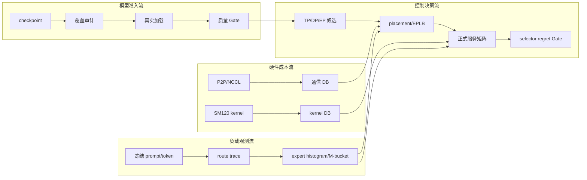
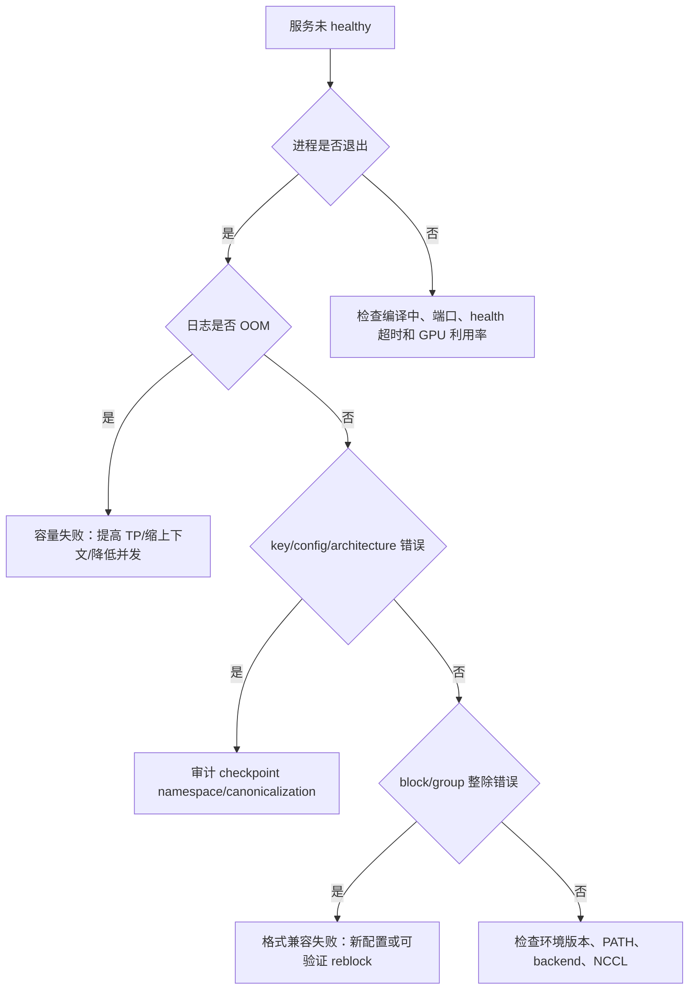

# Q-TopoMoE 项目接管与操作手册

> 版本：2026-08-13
> 适用平台：`gpu-111`，单机 8×RTX 5090、双 NUMA、PCIe、CUDA SM120
> 当前服务器代码根目录：`/data/moe`
> 当前 GitHub 分支：`agent/sync-q-topomoe-project`
> 阅读对象：需要从“不了解实现细节”逐步过渡到“能独立判断状态、复现实验、定位故障和继续开发”的项目负责人。

## 0. 如何使用本手册

先读第 1–5 章，了解架构、当前状态和事实边界；需要复现实验或排查问题时，
再查第 6–10 章。正式接管前按第 14 章演练一次，不要上来就启动 8 卡实验。

遇到一个陌生文件、日志或结论时，按以下顺序判断：

```text
它属于哪个阶段？
→ 输入是否冻结？
→ 使用哪个 checkpoint/框架/backend？
→ 是计划值、micro 实测、服务实测还是正式 Gate？
→ status 是 accepted、rejected、running 还是 historical？
→ 对应的 manifest 和 SHA-256 在哪里？
```

如果以上问题不能回答，就不要把该结果写入最终结论。

## 1. 项目概况

### 1.1 项目解决什么问题

Q-TopoMoE 研究的是：在没有 NVLink、只有 PCIe 的 8 卡 RTX 5090 服务器上，
如何为量化 MoE 模型选择合适的模型格式、GPU 映射、TP/DP/EP、MoE kernel、
专家放置和迁移策略，在保持质量的前提下降低延迟、提高吞吐并控制长尾。

这里的“量化感知”指系统决策显式考虑：

- BF16、FP8、W4A16、NVFP4 的权重和 scale 布局；
- 不同格式能够使用的 vLLM/SGLang backend；
- 专家实际字节数和显存余量；
- 量化后 route top-k 与专家负载的变化；
- TP/EP 分片对 block、group 和专家数整除的要求；
- 在线迁移的字节数、阻塞时间和恢复代价。

它不是 QAT 项目。当前没有量化感知训练分支；采用已有量化 checkpoint 和 PTQ，
然后用严格服务与质量 Gate 决定是否准入系统主线。

### 1.2 最终系统由四条数据流组成



### 1.3 最重要的工程纪律

- checkpoint 能 import 不等于能服务；必须通过 health、models、completion、metrics。
- TP1 OOM 是容量结论，不是 loader 兼容性失败。
- micro kernel 快不等于端到端服务快。
- `CUDA_VISIBLE_DEVICES` 有 8 卡不代表 EP world size 是 8。
- 正在运行的部分准确率不是正式准确率。
- `finish_reason=length` 的样本是未完成，不是错误答案。
- sampled 评测与模型卡官方分数不可直接比较。
- selector 的 median regret 通过，不代表 p95 regret 可以忽略。
- `docs/archive/` 中的结果只能做历史对照。

## 2. 当前项目状态仪表板

以下状态已更新至 2026-08-16。运行中数字会变化，查询方法见第 11 章。

| 模块 | 当前状态 | 可否作为正式结论 |
|---|---|---|
| Phase 0 拓扑/P2P/NCCL | P2P 已生效，正式通信成本已重测 | 可以 |
| BF16/FP8 服务基线 | 通过；容量和 block 对齐失败已单列 | 可以 |
| W4A16 canonical | 覆盖、加载、Triton 质量、多卡均通过 | 可以 |
| 官方 RedHatAI NVFP4 | 覆盖、TP1/2、c1/c32、sampled 质量通过 | 可以 |
| 自生成 NVFP4 v1 | 服务通过，质量相对 BF16 下降 3.45 点 | 不可，Gate rejected |
| BF16↔W4/NVFP4 route drift | 已完成 | 可以 |
| W4A16 full-set | MMLU-Pro 84.58%、C-Eval 89.27%，21 条未收敛单列 | 可以，需保留边界 |
| NVFP4 full-set | 严格合并完成；18 条长输出显式未完成 | 可以，需保留边界 |
| FP8 full-set | 严格合并完成；26 条长输出显式未完成 | 可以，需保留边界 |
| BF16 full-set | 重新完整运行并严格合并；19 条长输出显式未完成 | 可以，需保留边界 |
| 三格式共同分母 | 24,330 条；BF16/FP8/NVFP4 为 86.9955%/86.9749%/86.3009% | 可以 |
| Phase 4 kernel/backend | 真实 M-bucket 和多 backend DB 已完成 | 可以 |
| Phase 5 Level 2 | 正确性通过，但真实 M 加权慢 34.4% | 已按停损规则停止 |
| Phase 6 TP/DP/EP | P2P 后重测完成，历史错误 EP 标签已纠正 | 可以 |
| Phase 7 在线迁移 | 384 请求失败 0，迁移/恢复 Gate 通过 | 可以 |
| Phase 8 正式矩阵 | 四候选×108 cells×5 重复通过 | 可以 |
| Phase 8 selector | median regret 0%，p95 regret 43.17% | 不可上线 |

当前三条强约束：

1. 正式 NVFP4 只能使用已准入的 RedHatAI checkpoint；selfgen v1 不进入 EP/EPLB。
2. Phase 8 selector 不得驱动在线动态切换。
3. 三格式 full-set 结论只使用共同可评分分母；显式未完成项不得静默计对或计错。

## 3. 机器、路径与仓库关系

项目有四类位置，不能混淆：

| 类型 | 路径/位置 | 用途 |
|---|---|---|
| Windows 本地 Git | `C:\Users\29876\Documents\Codex\2026-08-03\new-chat-2\work\moe-push-20260804` | 编辑、提交、推送文档与代码 |
| GPU 服务器代码 | `gpu-111:/data/moe` | 正式执行入口 |
| 模型与大结果 | `gpu-111:/data/models/test` | checkpoint、JSONL、日志、长任务输出 |
| GitHub | `lcj1111/moe` 的 `agent/sync-q-topomoe-project` | 代码、配置、摘要、manifest 与复现文档 |

服务器旧路径 `/home/k8s-ops/moe` 只出现在历史证据中；当前代码根目录是 `/data/moe`。
BF16 ModelScope cache 仍可位于 `/home/k8s-ops/.cache/modelscope/...`，这不等于代码仓库没有迁移。

### 3.1 为什么大结果不全部放 Git

完整模型、route 数组、响应 JSONL 和服务日志可能达到 GB 级。项目采用：

- Git：代码、配置、小型评测集、摘要 JSON、manifest、SHA-256；
- `/data/models/test`：权重、完整响应、原始日志、大 trace；
- 文档：结论、路径、环境、输入哈希和失败边界。

因此“Git 里没有完整 JSONL”不表示不可复现，只要 manifest、路径和哈希完整。

## 4. 事实来源与状态词

### 4.1 事实优先级

同一事实有多个版本时，按以下顺序：

1. 最新正式 Gate JSON，且输入哈希匹配；
2. `docs/results/` 中最新收尾报告；
3. [逐步执行 Runbook](Q-TopoMoE_逐步执行Runbook.md)中的预注册规则；
4. 日期化交接文档；
5. `docs/archive/` 历史结果。

`configs/models/registry.yaml` 的部分 `status` 是项目启动时登记值，例如仍可能写着
`not_generated` 或 `requires gate`。它适合记录模型身份，不应越过更新更晚的正式 Gate。

### 4.2 状态词的含义

| 状态 | 含义 | 可以做什么 |
|---|---|---|
| `accepted` | 所有预注册 Gate 通过 | 可进入下游正式候选 |
| `rejected` / `gate_failed` | 测试已完成但不达标 | 保留证据，退出主线或修复后以新版本重跑 |
| `running_*` | 任务仍在执行 | 只报告进度，不报告最终准确率 |
| `base_completed_rerun_required` | 基础轮结束但仍有截断 | 构造定向续跑，不直接发布 |
| `blocked_*` | 前置数据或能力缺失 | 补前置，不把占位值当实测 |
| `historical` / `archive` | 已被替代或仅作对照 | 用于解释演进，不作为当前配置 |

### 4.3 四类数字不能混用

| 类型 | 示例 | 允许的表述 |
|---|---|---|
| 计划值 | benchmark plan 中的 M bucket | “待测单元” |
| micro 实测 | CUTLASS/Triton 单 kernel μs | “kernel latency” |
| 服务 smoke | 32 请求 p50/p95 | “短筛选/可服务” |
| 正式 Gate | 108-cell×5、full-set 24,374 | “正式矩阵/质量结论” |

## 5. 目录地图

| 目录 | 职责 | 先看哪个文件 |
|---|---|---|
| `env/` | 路径、环境切换、依赖和硬件检查 | `activate.sh`、`project.env`、`check_env.sh` |
| `configs/models/` | 模型身份与格式登记 | `registry.yaml` |
| `configs/evaluation/` | 冻结质量输入与 manifest | `README.md` |
| `configs/workloads/` | M-bucket、cache、arrival、正式 108-cell workload | `phase8_formal_controlled_v1.json` |
| `configs/kernels/` | kernel benchmark 计划与实测 DB | `phase4_kernel_db.json` |
| `configs/communication/` | P2P 后 NCCL 成本 | `nccl_cost_db.json` |
| `configs/strategies/` | 候选、observation、runtime plan | `phase8_candidates*.json` |
| `serving/` | 统一服务启动和四级验收 | `start_server.sh`、`acceptance.sh` |
| `clients/` | smoke、cache/arrival、质量客户端 | `smoke.py`、`quality_eval.py` |
| `quantization/` | W4/NVFP4 量化、审计、重分块 | `quantize_*.py`、`audit_nvfp4.py` |
| `traces/` | vLLM 原生 route 捕获和 trace manifest | `capture_routes.py` |
| `analysis/` | route 漂移分析 | `route_drift.py` |
| `phase4/` | M-bucket 生成 | `workload/generate_m_buckets.py` |
| `phase7/` | 迁移成本和离线 placement | `migration_cost.py`、`placement.py` |
| `selector/` | kernel、backend、EPLB 和策略选择数据结构 | `strategy_selector.py` |
| `runtime_patches/` | 显式启用的 NVFP4 EPLB runtime bridge | `qtopomoe_eplb/sitecustomize.py` |
| `scripts/` | 跨阶段 runner、聚合、Gate 和诊断 | 见第 10 章 |
| `tests/` | 不加载大模型的结构/逻辑回归 | `python -m unittest discover -s tests` |
| `docs/results/` | 当前人类可读结论 | 各阶段收尾文档 |
| `docs/archive/` | 被拒绝或被替代结果 | 只作历史审计 |

## 6. 模型格式与后端

### 6.1 BF16

- 作用：质量与路由参考、容量上界。
- 权重约 67 GB，32 GB/卡上 TP2 不够，TP4/TP8 可服务。
- 不能把 TP2 OOM 解释为框架或通信失败。
- 旧 full-set 被外部 SIGTERM 中断，不能作为同协议完整基线。

### 6.2 FP8

- 作用：高质量、高吞吐主候选。
- FP8 TP2 是 Phase 8 Pareto 候选之一，资源开销最低。
- TP8 曾因分片后 expert 维度 64 不满足 block128 而失败，这是格式对齐限制。
- `auto` backend 可能选择 DeepGEMM 并触发 `Unknown SF transformation`；正式已验证路径强制 Triton。

### 6.3 W4A16

- 作用：权重 4 bit、激活 BF16 的低显存候选。
- 原始导出需要 canonicalization 才能被上游 Qwen3.5 MoE loader 正确读取。
- 正式质量后端是 Triton；Marlin 路径曾出现严重质量回退。
- group128→group64 是无损布局变换，不是重新量化，解决部分 TP 分片对齐问题。
- Phase 8 正式矩阵中 W4A16 EP4 被其他候选支配，但仍保留为技术证据。

### 6.4 官方 NVFP4

- 来源：RedHatAI/Qwen3.6-35B-A3B-NVFP4。
- 40 层×256 experts×3 projection = 30,720 routed projection 全覆盖。
- 非 EP TP1/TP2 使用 `VLLM_CUTLASS` 原生 SM120 路径。
- EP4/EP8 分片服务实际选择 MARLIN；不能用 CUTLASS micro 数字冒充 EP 服务延迟。
- sampled 质量总体相对 BF16 下降 0.86 点，准入主线。

### 6.5 自生成 NVFP4 v1

- 覆盖、canonicalization 和服务均通过。
- MMLU-Pro sampled 质量下降导致总体相对 BF16 -3.45 点。
- 问题集中在 activation input scale，不是数据、template、请求失败或截断。
- 当前状态是 rejected；任何 v2 都是新 checkpoint，必须完整重跑 Gate。

## 7. 核心模块卡片

每张模块卡片都按“目的—输入—实现—输出—Gate—常见错误”组织。

### 7.1 环境与配置模块

**目的**：让路径、CUDA、NCCL、模型和 venv 可审计，避免某次 shell 偶然能跑。

**关键实现**：

- `env/project.env`：服务器默认路径、CUDA 13、SM120、NCCL 和模型位置；
- 机器私有覆盖文件 `local.env`：由 [local.env.example](../env/local.env.example) 复制后填写，
  不进入 Git；仓库中看不到该文件是正常状态；
- `env/activate.sh`：加载项目环境，提供 `qtopomoe_use_vllm`、
  `qtopomoe_use_sglang`、`qtopomoe_gpu_status`、`qtopomoe_new_run`；
- `env/check_env.sh`：检查 8 卡、SM120、模型、venv、NCCL tests 和 `NCCL_IB_DISABLE=1`；
- `scripts/validate_configs.py`：检查 JSON/YAML 能否解析及最小 schema。

**基础检查**：

```bash
cd /data/moe
source env/activate.sh
make check
qtopomoe_gpu_status
```

**Gate**：`failures=0`。warning 可以存在，但必须解释。

**常见错误**：在 SGLang venv 中运行 vLLM，或在量化 venv 中覆盖 serving 包。
解决方式是新 shell 重新 `source env/activate.sh`，只选择一个框架环境。

### 7.2 Phase 0 拓扑与通信模块

**目的**：建立真实 GPU 对和 collective 成本，而不是按 GPU 编号猜测。

**输入**：8 卡硬件、NUMA、PCIe、P2P read/write、NCCL tests。

**实现**：

- `topology/collect_hardware.sh` 采集硬件与系统信息，`topology/gpu_peer_bf16.py`
  验证 peer/BF16，`topology/run_nccl_formal.sh` 执行正式通信矩阵；
- `scripts/build_nccl_cost_db.py` 将正式统计归一化为成本 DB；
- `configs/experiments/topology_gpu111.yaml` 记录 NUMA/P2P 和逻辑分组；
- `configs/communication/nccl_cost_db.json` 是当前 P2P 后成本；
- `nccl_cost_db_nop2p_20260803.json` 只作历史对照。

**Gate**：8 卡 BF16 正确、collective `wrong=0`、peer 状态明确、路径差异可复现。

**关键经验**：P2P 生效后性能排序发生过反转，因此 BIOS、驱动、内核或 P2P 状态变化后
必须重跑 Phase 0，不能沿用旧成本 DB。

### 7.3 服务与 checkpoint Gate

**目的**：验证 checkpoint 真正可通过 API 服务，而不是只验证 Python import。

**实现分层**：

1. `serving/start_server.sh`：统一 SGLang/vLLM 基础启动；
2. `serving/acceptance.sh`：health、models、真实 completion、metrics；
3. `scripts/gate_qwen35_checkpoint.sh`：服务生命周期、日志 coverage、smoke、质量和
   `gate_status.json`；
4. `clients/smoke.py`：并发、TTFT、TPOT、cache 和 arrival 测量。

**最小 Gate 示例**：

```bash
cd /data/moe
source env/activate.sh

BACKEND=vllm \
MODEL_PATH=<checkpoint目录> \
GPU_IDS=0,1 \
TP_SIZE=2 \
PORT=31310 \
SERVED_NAME=qtopomoe-manual-gate \
OUT_DIR=/data/models/test/qtopomoe_manual_gate_<唯一ID> \
SMOKE_REQUESTS=32 \
SMOKE_CONCURRENCY=8 \
bash scripts/gate_qwen35_checkpoint.sh
```

**必须检查的产物**：

- `gate_status.json` 的 `status`；
- `server.log` 的 loader/backend/coverage/OOM；
- `acceptance/acceptance.json`；
- smoke 的成功数和延迟摘要；
- GPU PID 是否只在预定设备上。

**不要做**：重复使用旧 `OUT_DIR`、只看 PID、只看 health、用 `pkill python` 清理。

### 7.4 量化与 canonicalization 模块

**目的**：生成或规范化 W4A16/NVFP4，同时证明专家覆盖和数值不被意外修改。

**主要入口**：

- `quantization/quantize_w4a16.py`；
- `quantization/quantize_nvfp4.py`；
- `scripts/audit_w4a16.py`、`quantization/audit_nvfp4.py`；
- `scripts/canonicalize_qwen35_text_checkpoint.py`；
- `quantization/reblock_w4a16_128_to_64.py`。

**覆盖基线**：40×256×3=30,720 routed expert projection。router、embedding、
lm_head、linear attention 的保留/排除必须符合 recipe，不能只数 safetensors 大小。

**canonicalization 做什么**：把 text-only 模型无法识别的
`model.language_model.*` wrapper 前缀映射到 `model.*`，并生成逐张量 shape、dtype、
值一致性证据。它不改变量化值，也不应被描述为重新量化。

**完整准入顺序**：

```text
校准 manifest
→ 量化运行
→ 静态覆盖审计
→ canonicalization（如需要）
→ TP1 容量
→ TP2
→ health/models/completion/metrics
→ c1/c32
→ sampled 质量
→ full-set 质量
```

### 7.5 质量评测模块

**目的**：在完全冻结的输入和 scorer 下比较模型格式。

**输入必须包含**：数据集 revision、原始文件哈希、样本索引/ID、顺序、prompt、
few-shot、tokenizer、chat template、thinking、sampling、seed 和 `max_tokens`。

**客户端实现**：`clients/quality_eval.py`。

- 按 manifest 的 `messages` 调用 OpenAI-compatible API；
- 并发由 semaphore 控制；
- `finish_reason=length` 或 completion tokens 达上限标记为 truncated；
- truncated 的 `correct=None`，不会静默计为错误；
- `--checkpoint-every` 原子替换结果文件；
- `--resume` 只跳过相同 ID 且无 error 的记录；
- manifest ID 重复会直接拒绝。

**summary 关键字段**：

| 字段 | 含义 |
|---|---|
| `requested` | manifest 样本数 |
| `completed` | 无请求错误的记录数 |
| `failed` | HTTP/解析/超时等请求错误数 |
| `truncated` | 输出达到长度上限数 |
| `scored` | 有确定判分结果的样本数 |
| `correct/accuracy` | 只在 scored 集合上计算 |
| `resumed` | 本次从已有结果复用的记录数 |

**质量 Gate**：FP8 相对 BF16 ≤0.5、NVFP4 ≤1.5、W4A16 ≤2.0 个绝对百分点
是 Runbook 的预注册工程门槛。sampled 结果用于早停，full-set 才用于最终结论。

### 7.6 Route trace 与漂移模块

**目的**：回答“量化后选择了哪些不同专家，负载分布是否改变”。

**入口**：

```bash
python traces/capture_routes.py \
  --model-path <checkpoint> \
  --model-id <稳定ID> \
  --quant-format <bf16|w4a16|nvfp4> \
  --prompt-manifest <冻结manifest> \
  --indices <逗号分隔索引> \
  --output-dir <新目录> \
  --gpu-ids 0,1,2,3 \
  --tp-size 4 \
  --seed 42
```

分析：

```bash
python analysis/route_drift.py \
  --reference-dir <BF16 capture> \
  --candidate-dir <量化 capture> \
  --output <新 JSON>
```

**输出**：逐 token/layer top-k expert IDs、weights、expert histogram、M-bucket、
Jaccard、flip rate、expert count correlation、CV 等。

**边界**：当前 vLLM trace 不导出 `expert_service_time_us`。kernel latency 必须从
独立 benchmark 获取，不能填一个估算值冒充原生 trace。

### 7.7 Phase 4 kernel/backend 模块

**目的**：对真实 M 分布选择可用 backend/config。

**关键语义**：`m_bucket` 是 batch 总 token 数；
`prefill_m=input_tokens×concurrency`，`decode_m=concurrency`。它不是每专家 token 数。

**入口**：

- `phase4/workload/generate_m_buckets.py`：确定性 M/workload；
- `scripts/plan_phase4_kernel_benchmark.py`：生成待测矩阵，不执行 CUDA；
- `scripts/bench_moe_kernel.py`：实测服务同款 kernel；
- `scripts/merge_kernel_measurements.py`：合并 DB；
- `selector/kernel_db.py`、`backend_selector.py`：查询和选择。

**防误选逻辑**：只有 `measured=true`、`valid=true` 且带 p50/p95 的记录可被默认选择；
缺失测量抛 `SelectionError`。`allow_unmeasured=True` 只能用于明确的开发 dry-run。

### 7.8 Phase 5 Level 2 模块

**目标**：融合 permute、activation quant/scale 和 pack。

**结论**：独立 Triton kernel 的极端 shape 正确性全部通过，大 M 对 naive Torch
reference 有 2.4–8.6×收益；但与真实 vLLM prepare 路径比较后，真实 route 加权慢
34.4%。因此按 Runbook 停止 Level 2，不接入 vLLM。

接管时不要把“代码仍在 `scripts/fused_permute_quant.py`”误认为“生产路径已经启用”。

### 7.9 Phase 6 TP/DP/EP 模块

**目的**：在端到端服务中比较并行策略，而不是只看 kernel。

**入口**：`scripts/run_phase6_matrix.sh`。

**每格流程**：启动 → health → 32 请求 smoke → summary → backend/rank/显存审计。

**最关键检查**：从日志和进程组确认实际 world size、TP、DP 和 EP rank。
历史上 `ep8_tp1` 实际 world=1，`ep4_tp2` 实际是 EP2，这些名称已被纠正。

**当前结论**：P2P 对通信密集配置收益最大；P2P 前数据只作历史对照。

### 7.10 Phase 7 placement 与在线 EPLB 模块

**离线部分**：

- `phase7/migration_cost.py` 测同卡、同 NUMA、跨 NUMA专家拷贝；
- `phase7/placement.py` 比较 static linear、round-robin、load-only、load-topology；
- `selector/eplb_policy.py` 提供量化字节、拓扑成本、HBM、离线 plan 和控制器状态机。

`OnlineEPLBController` 只返回决策，不直接修改运行时，这是安全边界。

**在线部分**：

- `scripts/build_runtime_placement_plan.py` 生成满足每层每 rank 固定槽位的 plan；
- `runtime_patches/qtopomoe_eplb/sitecustomize.py` 是显式 opt-in bridge；
- `scripts/launch_online_eplb_probe.sh` 启动探针；
- `scripts/analyze_online_eplb_gate.py` 分析稳定、迁移、恢复窗口。

**当前正式结果**：384 请求失败 0；稳定/迁移/恢复 p99 为
1082.04/2166.96/988.83 ms，首次权重 rearrangement 0.83 s。

**表述边界**：原生 vLLM 对 `CompressedTensorsW4A4Nvfp4MoEMethod` 仍不支持 EPLB；
当前通过的是项目的显式 runtime bridge，不可写成“vLLM 原生已支持 NVFP4 EPLB”。

### 7.11 Phase 8 联合选择器模块

**候选维度**：quant format/checkpoint、TP/DP/EP、GPU mapping、backend、EPLB、
冗余专家、显存和迁移成本。

**核心类**：

- `StrategyCandidate`：候选静态属性；
- `WorkloadObservation`：输入/输出长度、并发、M、route、cache、arrival；
- `CostModel`：kernel+通信+不均衡+迁移的透明估计；
- `StrategySelector`：过滤不可行候选并选择；
- `evaluate()`：top1、median/p95 regret、overhead、invalid rate。

**正式测量**：FP8 TP2、NVFP4 EP4、NVFP4 EP8、W4A16 EP4，108 cells，
每候选五次，10,000 次 bootstrap。

**当前 Gate**：

- top1 56.48%，只报告；
- median regret 0%，通过；
- p95 regret 43.17%，失败；
- 控制开销 0.0107%，通过；
- 不可行误选率 0，通过。

所以正式测量矩阵已完成，但 selector 不能在线启用。下一版需要实际 KV-cache hit、
queue depth、近期到达率和短窗口 p99，并用新的独立 workload 测试。

## 8. 三条完整执行链

### 8.1 新 checkpoint 准入链

```text
登记 repo/revision/path/config hash
→ 检查 config 与 tensor key namespace
→ 覆盖审计
→ 必要时 canonicalize/reblock
→ TP1 容量
→ TP2 多卡
→ 四级 acceptance
→ c1/c32 smoke
→ sampled quality
→ full-set quality
→ route trace
→ TP/DP/EP 和 Phase 8 候选
```

任何一步失败都不能跳到后面。修复后用新输出目录重跑，不覆盖 rejected 证据。

### 8.2 Full-set 质量链

```text
验证冻结 manifest 与 SHA
→ 检查 GPU/PID/端口
→ setsid 启动 A/B 双服务
→ 四级 acceptance
→ A/B 客户端 checkpoint
→ 审计 failed/truncated/finish_reason
→ 仅筛选 truncated ID
→ 提高有限输出上限续跑
→ 按 ID 合并唯一最终记录
→ 样本总数/重复/缺失/哈希 Gate
→ 分科与总体准确率
```

### 8.3 联合策略链

```text
P2P/NCCL DB + kernel DB + route/M histogram
→ 候选可行性过滤
→ smoke/capacity prepass
→ cache/arrival pilot
→ 冻结请求率
→ 108-cell 随机五重复
→ bootstrap 聚合
→ held-out selector regret
→ regret 通过后在线控制
```

## 9. NVFP4 full-set 截断续跑

### 9.1 当前任务身份

- 基础轮：`/data/models/test/qtopomoe_quality_runs/full_official_nvfp4_ep4_pair_v1`；
- 续跑：`/data/models/test/qtopomoe_quality_runs/full_official_nvfp4_ep4_pair_trunc_v1`；
- 续跑输入：`/data/models/test/qtopomoe_quality/nvfp4_trunc_rerun_v1`；
- A/B 数量：499/472，总计 971；
- C-Eval `max_tokens=8192`；MMLU-Pro `max_tokens=12000`；
- `MAX_MODEL_LEN=32768`；并发 4；seed 42；
- A 使用 GPU0–3，B 使用 GPU4–7。

续跑于手册生成期间结束：A/B 分别完成 499/499 和 472/472，`failed=0`；A/B
仍分别有 11/7 条截断，总计 18 条，其中 C-Eval 15 条、MMLU-Pro 3 条。manager
因此正确写入 `base_completed_rerun_required`，而不是 `base_completed`。当前没有自动启动
第二轮；必须先检查这 18 条的 `finish_reason`、响应尾部和答案抽取，再决定是否有限补跑。

### 9.2 为什么关闭 Codex/SSH 不影响任务

任务通过 `nohup setsid` 脱离上层会话；manager、server 和 client 有独立 PID，客户端
每 100 条原子 checkpoint 并支持 `--resume`。只有服务器重启、进程被终止、OOM 或文件系统
故障才会影响任务。

### 9.3 完成后不能直接做什么

不能直接把续跑 summary 当 24,374 条全量结果。续跑只包含 971 条；必须将基础轮中未截断
记录与续跑最终记录按 ID 合并，并验证：

- 总数恰好 24,374；
- ID 唯一且与冻结 manifest 完全相等；
- `failed=0`；
- 残余 truncated 被单独列出；
- 每个最终记录知道来自 base 还是 rerun；
- 合并 JSONL 和摘要有 SHA-256；
- 原始 base/rerun 目录保持只读，不覆盖。

## 10. 常用脚本速查

| 任务 | 脚本 |
|---|---|
| 环境检查 | `make check`、`env/check_env.sh` |
| 环境快照 | `scripts/snapshot_env.sh` |
| 冻结 checkpoint | `scripts/freeze_checkpoint.py` |
| checkpoint 服务 Gate | `scripts/gate_qwen35_checkpoint.sh` |
| 四级 acceptance | `serving/acceptance.sh` |
| 并发/缓存/到达 smoke | `clients/smoke.py` |
| 质量评测 | `clients/quality_eval.py` |
| full-set A/B | `scripts/run_fullset_quality_pair.sh` |
| 截断 manifest | `scripts/build_fullset_truncation_manifest.py` |
| W4/NVFP4 审计 | `scripts/audit_w4a16.py`、`quantization/audit_nvfp4.py` |
| canonicalize | `scripts/canonicalize_qwen35_text_checkpoint.py` |
| route capture | `traces/capture_routes.py` |
| route drift | `analysis/route_drift.py` |
| kernel benchmark | `scripts/bench_moe_kernel.py` |
| Phase 6 matrix | `scripts/run_phase6_matrix.sh` |
| migration benchmark | `scripts/bench_expert_migration.py` |
| runtime plan | `scripts/build_runtime_placement_plan.py` |
| online migration Gate | `scripts/analyze_online_eplb_gate.py` |
| Phase 8 runner | `scripts/run_phase8_repeated.py` |
| Phase 8 聚合 | `scripts/aggregate_phase8_repeated.py` |
| 分拆结果合并 | `scripts/combine_phase8_split_runs.py` |
| selector Gate | `scripts/evaluate_phase8_nearest_selector.py` |

## 11. 日常操作标准流程

### 11.1 每次操作前

```bash
ssh gpu-111
cd /data/moe
source env/activate.sh

qtopomoe_gpu_status
df -h / /data
ss -ltnp
git status --short --branch
```

确认：

- GPU 上的 PID 是否属于本项目；
- 端口是否空闲；
- `/` 和 `/data` 是否有足够空间；
- 代码版本是否是预期 commit；
- 输出目录是否是新目录；
- 模型和 manifest 的 config/SHA 是否匹配。

### 11.2 查询 full-set 进度

```bash
RUN=/data/models/test/qtopomoe_quality_runs/full_official_nvfp4_ep4_pair_trunc_v1

cat "$RUN/status.json"
wc -l \
  "$RUN/shard_a/quality.results.jsonl" \
  "$RUN/shard_b/quality.results.jsonl"
ps -p 1193994,1212200,1212201 -o pid,stat,etime,cmd
nvidia-smi --query-gpu=index,utilization.gpu,memory.used --format=csv
```

结果文件每 100 条才刷新，`wc -l` 可能落后于客户端实际完成数。

### 11.3 查看日志而不干扰运行

```bash
tail -n 80 "$RUN/shard_a/client.log"
tail -n 80 "$RUN/shard_b/client.log"
tail -n 120 "$RUN/shard_a/server.log"
tail -n 120 "$RUN/shard_b/server.log"
```

搜索严重问题：

```bash
grep -E 'Traceback|CUDA out of memory|EngineDead|HTTP 5|NCCL.*error' \
  "$RUN"/shard_*/{server,client}.log
```

日志没有新增行不一定是挂死；还要结合 GPU utilization、PID state 和结果行数变化。

### 11.4 安全停止原则

除非用户明确要求或 Gate 脚本自身清理，不要停止正在运行的任务。确需停止时：

1. 从 `status.json` 和 `ps` 双重确认 PID；
2. 确认命令行包含本项目输出目录；
3. 先停止 manager，让脚本的 cleanup 处理自己的 children；
4. 不使用 `pkill python`、`killall`、模糊 grep 后批量 kill；
5. 记录停止原因、时间、PID 和可否 resume。

### 11.5 启动 full-set

启动前必须确认 8 卡和 31620/31621 空闲。示例：

```bash
cd /data/moe
OUT=/data/models/test/qtopomoe_quality_runs/<新的唯一目录>

nohup setsid bash scripts/run_fullset_quality_pair.sh nvfp4 "$OUT" \
  > "$OUT.manager.log" 2>&1 < /dev/null &
```

FP8 将格式改为 `fp8`；脚本会使用 GPU0,1 和 GPU4,5，并强制 Triton。
不要在 NVFP4 任务未闭合时抢占它的 GPU。

### 11.6 断点续跑

只有输出目录属于同一冻结输入、模型、格式和参数时才可：

```bash
RESUME=1 nohup setsid bash scripts/run_fullset_quality_pair.sh <格式> <同一输出目录> \
  > <新的manager日志> 2>&1 < /dev/null &
```

恢复前核对 `server.command.txt`、manifest SHA 和已有结果 ID；不能用 `RESUME=1`
把不同模型或不同 prompt 的结果混在一起。

### 11.7 GitHub 同步

服务器原始结果不直接 `git add`。在本地仓库：

```powershell
git status -sb
git diff --check
git add -- <本次明确文件>
git diff --cached --stat
git commit -m "简洁中文说明"
git push -u origin agent/sync-q-topomoe-project
git ls-remote origin refs/heads/agent/sync-q-topomoe-project
```

禁止在有无关改动时使用不加区分的 `git add -A`。

## 12. 故障定位决策树

### 12.1 服务启动失败



### 12.2 质量下降

按以下顺序排除：

1. 是否相同样本 ID、prompt、few-shot、chat template、thinking、seed；
2. 是否有 failed/truncated/答案抽取失败；
3. 是否使用相同模型 revision 和正确 canonical checkpoint；
4. 是否 backend 隔离，例如 Triton vs Marlin；
5. coverage、scale、ignore 列表是否相同；
6. route drift 与 activation scale 是否发生系统变化；
7. 以上一致后，才将差异归因于量化方法。

禁止通过修改 scorer、挑样本、借用另一 checkpoint 的 scale 来“修复”质量。

### 12.3 GPU 利用率不均

- 量化阶段：PTQ 可能主要由一个 rank 串行处理层/专家，不等同于训练数据并行；
- TP：各卡权重分片相同，但 rank0 可能承担额外调度；
- EP：负载由 route 决定，必须看每 rank 专家与 token histogram；
- DP：请求分发不均可能来自到达和调度，而不是模型；
- 先看进程映射、world size、显存和 route，再决定是否异常。

### 12.4 进度不再增长

同时检查：

```text
PID 是否存在且 state 非 Z/D？
GPU utilization 是否持续非零？
server.log 是否仍有 HTTP 200/throughput？
结果文件是否只是未到 checkpoint-every？
磁盘是否满？
客户端是否在单个 1200 秒超时请求中？
```

只有连续多次检查均无变化且存在明确错误，才进入修复；不要凭一次 `wc -l` 重启任务。

### 12.5 selector 结果很差

先区分：

- 候选不可行：容量、格式、rank 或 backend Gate 问题；
- 测量噪声：bootstrap 区间重叠；
- 特征不足：cache、queue、arrival 无法解释；
- 模型错误：成本公式或单位不一致；
- 数据泄漏：查找时读取 held-out oracle。

当前问题主要是特征不足和长尾排序不稳，不应该直接上 RL，也不应记忆 108 个 oracle。

## 13. 你需要真正理解的十个细节

1. **TP、DP、EP 不同**：TP 分一个张量，DP 复制模型分请求，EP 分专家；它们的通信和
   显存约束不同。
2. **MoE active 参数少不等于总权重小**：每 token 只激活部分专家，但所有专家权重仍需存放。
3. **量化格式不仅是 bit 数**：group size、scale dtype、packed key、分片整除决定 backend 能否运行。
4. **route 漂移与质量不是同一指标**：top-k 变化多也可能总体质量稳定；它主要影响负载和 placement。
5. **P2P 是环境状态，不是永久硬件标签**：生效前后所有通信敏感性能必须分别看待。
6. **CUDAGraph/compile 会改变启动和吞吐**：清理缓存后首次启动慢，不等于推理退化。
7. **prefix-cache 受物理 page 对齐**：语义复用 100% 不代表 cached tokens 100%。
8. **同步迁移必然可能阻塞**：项目的价值在于测出阻塞和恢复，而不是隐藏它。
9. **Pareto 与 oracle 不同**：Pareto 保留资源/性能不被支配候选；oracle 是某个 workload 的最佳候选。
10. **regret 是上线门槛**：选择器偶尔选对不够，p95 长尾错误必须受控。

## 14. 接管演练路线

### 第 1 级：只读理解

目标：不运行 GPU 任务，也能说明项目现状。

任务：

1. 阅读[项目执行全史](Q-TopoMoE_项目执行全史与问题处置_20260813.md)；
2. 阅读[阶段 7–8 正式收尾](results/phase7_phase8_formal_closeout_20260812.md)；
3. 从一个 accepted JSON 和一个 rejected JSON 中找到 status、输入和原因；
4. 能解释为什么 selfgen NVFP4 不准入、selector 不上线。

通过条件：能在不查看聊天记录的情况下复述当前四条正式结论和三个禁止项。

### 第 2 级：本地控制面

目标：理解不需要 GPU 的核心逻辑。

任务：

```powershell
python -m unittest discover -s tests
```

若本地缺 `torch`，允许除 canonicalization 导入测试外的 41 项通过，并在服务器冻结环境
运行等价断言；不要为了文档测试污染本地环境。

然后：

- 生成一次临时 M-bucket；
- 读取 kernel DB 并解释一条 measurement；
- 对现有 observation 做一次离线 replay；
- 解释 selector 为什么过滤 unmeasured/invalid 候选。

### 第 3 级：服务器只读运维

目标：能安全判断长任务状态。

任务：

- 查询 GPU、PID、端口、状态文件、结果行数、磁盘；
- 区分 running、checkpoint 延迟、挂死和失败；
- 不终止任何进程；
- 输出一份包含时间、PID、进度、GPU、异常搜索的状态报告。

### 第 4 级：最小服务 Gate

目标：独立启动一个不会影响正式实验的最小服务。

前提：GPU 和端口明确空闲，模型路径已验证，使用新输出目录。

任务：启动 → acceptance → c1/c32 → 检查 backend/显存 → 由 gate 脚本清理。

通过条件：能够说明每个产物的用途，而不是只说“跑通了”。

### 第 5 级：小规模质量/route

目标：用冻结 sampled manifest 运行少量质量或 route capture。

通过条件：能核对 manifest hash、ID、template、finish_reason、scorer 与输出摘要。

### 第 6 级：正式任务负责人

目标：独立完成一种格式的 full-set 或一个正式 Phase 8 候选。

必须具备：预检、唯一输出目录、detached session、状态监控、失败恢复、结果 Gate、文档、
GitHub 同步和边界说明。

## 15. 接管验收问题

能独立回答以下问题，才算真正接管：

1. 为什么 BF16 TP2 OOM 不能算框架失败？
2. 为什么官方 NVFP4 可以进入主线，selfgen v1 不行？
3. canonicalization 修改了什么，没有修改什么？
4. 为什么 W4 的 Marlin 结果不能代表 W4 量化结论？
5. 为什么 P2P 生效后必须重跑 Phase 6/8？
6. `m_bucket=2048` 在本项目中是什么含义？
7. 为什么 CUTLASS NVFP4 micro 数据不能替代 EP4/EP8 MARLIN 服务数据？
8. 如何证明一个 full-set 样本是截断，而不是回答错误？
9. 为什么 NVFP4 续跑结束后不能直接报告续跑 accuracy？
10. 为什么历史 `ep8_tp1` 不是有效 EP8？
11. 原生 vLLM NVFP4 EPLB 与项目 runtime bridge 有什么区别？
12. 为什么 Phase 5 融合 kernel 正确且 micro 很快，仍然被停止？
13. 为什么 Phase 8 正式矩阵 accepted，但 selector 仍不能上线？
14. 什么情况下允许使用 `RESUME=1`？
15. 出现未知 GPU PID 时为什么必须停止操作而不是清理？

## 16. 未来任务与优先级

### P0：必须完成

1. 审计 NVFP4 续跑后剩余的 18 条截断，决定有限二次补跑或按协议列为未完成；随后进行
   唯一 ID 合并、全量 Gate 和哈希；
2. FP8 同协议 full-set、截断补跑与合并；
3. 若需要严格相对本机 BF16 比较，重跑 BF16 full-set；
4. 更新 README、数据清单和格式间最终质量对比。

### P1：selector 修复

1. 增加实际 KV-cache hit、queue depth、近期 arrival rate、短窗口 p99；
2. 冻结特征、模型和阈值；
3. 新建独立 workload，禁止继续在现有 108 cells 上反复调参；
4. 重新计算 median/p95 regret、overhead 和 infeasible misselection；
5. 全部通过后才做 trigger/cooldown/rollback。

### P2：发布收尾

1. 一键 smoke；
2. 机器可读 Gate 总表和失败矩阵；
3. 全仓 Markdown 链接、配置、哈希检查；
4. 最终复现顺序、局限性和 release tag。

### 可选研究，不阻塞主线

- selfgen NVFP4 v2 消融；
- ModelOpt mixed；
- 更严格的六候选 Pareto；
- 异步/分批迁移以降低同步迁移 p99。

## 17. 推荐阅读顺序

1. 本手册；
2. [项目执行全史](Q-TopoMoE_项目执行全史与问题处置_20260813.md)；
3. [逐步执行 Runbook](Q-TopoMoE_逐步执行Runbook.md)；
4. [数据与结果清单](DATA_CATALOG.md)；
5. [阶段 1 服务基线](results/phase1_service_baseline.md)；
6. [阶段 2 量化与质量](results/phase2_quantization_quality.md)；
7. [阶段 3 route 与官方评测](results/phase3_route_and_official_eval.md)；
8. [阶段 3 full-set 收尾](results/phase3_fullset_quality_closeout_20260812.md)；
9. [阶段 4–7 工程总结](results/phase4_to_phase7_engineering.md)；
10. [阶段 7–8 正式收尾](results/phase7_phase8_formal_closeout_20260812.md)；
11. [阶段 8 历史与校准](results/phase8_benchmark_history.md)。

## 18. 最小记忆卡

如果暂时只能记住一页，请记住：

```text
服务器代码：/data/moe
大模型/结果：/data/models/test
正式分支：agent/sync-q-topomoe-project
P2P：已生效；通信敏感结果看 P2P 后版本
正式 NVFP4：RedHatAI accepted
selfgen NVFP4 v1：quality rejected
W4：canonical + Triton
Phase 7：在线迁移 Gate accepted
Phase 8 矩阵：accepted
Phase 8 selector：p95 regret 43.17%，禁止上线
NVFP4 full-set：续跑后仍有 18 条截断待审计，未发布最终准确率
操作前：GPU/PID/端口/磁盘/commit/manifest/输出目录
任何结论：必须能指向 Gate、输入哈希和失败边界
```
